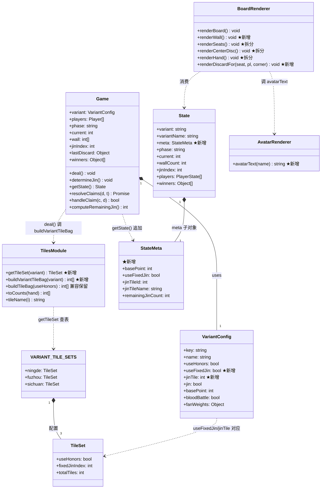
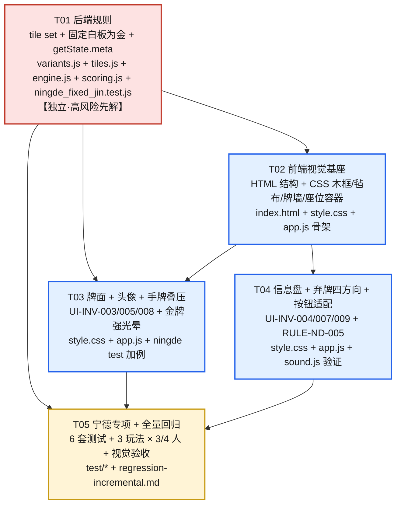

# 在线麻将 — 增量架构设计（UI 重构 + 宁德规则修正）

> **版本**: v2.0-incremental | **日期**: 2026-08-21 | **作者**: 高见远（架构师）
> **项目路径**: `C:/Users/Y/WorkBuddy/2026-08-20-15-33-48/mahjong-game`
> **上游输入**: `docs/prd-incremental.md`（许清楚 / 产品经理 v2.0-incremental）
> **本轮范围**: UI-INV-001 ~ UI-INV-010 + RULE-ND-001 ~ RULE-ND-005（共 15 条 P0）
> **定位**: 既有项目上的**纯增量改造** —— 复用 v1（R-001 ~ R-006）已落地的牌面图形化、出牌两步确认+飞出动效、动作按钮、事件差分音效、座位高亮等基础；本轮聚焦「雀神广东麻将」风桌面改造 + 宁德 112 张 + 固定白板为金。**不重写** 上一轮已 PASS 的任何代码。

---

## 0. 已拍板的前置决策（来自用户 + 上一轮 QA PASS 基础）

| # | 决策 | 对设计的约束 |
|---|------|--------------|
| D-1 | 视觉风格 = 「雀神广东麻将」桌面优先移植 | 深棕木框 + 青绿毡布 + 四角座位 + 中央圆盘 + 2D 牌墙；参考图已提供，本轮直接对标 |
| D-2 | 牌面图案 = **CSS 绘制**（沿用 v1） | 筒=同心圆 radial-gradient；条=竖竹条 repeating-linear-gradient + 节点；万=大号红楷体汉字；白板=空白+金边+光晕。**不用** SVG / 图片 |
| D-3 | 牌墙 = **2D 平铺牌背**（沿用 v1 牌背） | 4 条 `.wall-{top,bottom,left,right}` 容器，开局一次性渲染固定张数；**P0 不动态缩短**；**不** 3D 透视 |
| D-4 | 头像 = **首字母圆形占位**（无外部图片） | 圆形 div + 用户名首字，背景色按座位 hash 取 6 色之一（青/红/黄/蓝/紫/橙） |
| D-5 | 动作按钮 = 圆角大按钮 + 图标 + 脉冲 | ≥48px 高、圆角 8~12px；胡=红+ huPulse 动画；碰杠吃=橙系；过=灰系 |
| D-6 | 零新 npm 依赖、零外部图片/字体 | `package.json` 不变；纯 HTML/CSS/JS；`public/audio/` 不存在 |
| D-7 | 宁德 112 张 = **万 36 + 筒 36 + 条 36 + 白板 4** | 字牌 z0..z6（index 27..32）全部**不出现在牌池**；白板 z7（index 33）固定为唯一金牌 |
| D-8 | 固定白板为金 = **沿用 v1 现有百搭规则** | 白板可替任何万/筒/条牌组成面子/对子；不计入花色（`scoring.js` 的 `jinIndex` 机制已正确） |
| D-9 | 福州 / 川麻 **完全保持原样** | 136 张 + 骰子翻金（川麻无金）；差异完全在 `variants.js` 配置体现，引擎分支处理 |
| D-10 | 沿用 v1 的 **一炮多响 + 终局解耦 + 状态差分音效** 等基础设施 | 本轮**不重写** `engine.js` 主循环，只在 `deal()` / `determineJin()` / `getState()` 三个函数上做**最小分支**改造 |
| D-11 | 沿用 v1 的 `tileHTML()` / `tileFaceHTML()` / `pipsHTML()` / `mkBtn()` / `Fx.flyTile()` 等前端基础设施 | 本轮**不重写**这些函数；只在 `renderBoard` 拆分 5 个子函数（`renderWall` / `renderSeats` / `renderCenterDisc` / `renderDiscardAreas` / `renderHand`） |
| D-12 | QA PASS 的上一轮基线 **零回归** | `engine.test.js` / `multi_hu.test.js` / `repro_nan.js` / `ws_smoke.js` / `sfx_events.test.js` 五件套必须全绿 |

---

# Part A：系统设计

## 1. 实现方案与框架选型

### 1.1 技术栈结论：零新增依赖

| 维度 | 结论 | 说明 |
|------|------|------|
| 后端 | **沿用 Node.js + `ws`** | 仅改 `tiles.js` / `variants.js` / `engine.js` / `scoring.js` 四个数据/逻辑层文件 + 新增 1 个测试文件 |
| 前端 | **沿用纯 HTML/CSS/JS，零构建** | `index.html` 加结构包裹；`style.css` 在 v1 基础上扩展视觉分区与配色；`app.js` 拆分 `renderBoard` 5 个子函数 |
| 牌面 | **沿用 v1 CSS 绘制方案** | 上一轮已落地「筒=蓝圆 / 条=绿竹 / 万=红楷体 / 字=大号繁体」，本轮**仅在「白板 = 固定金」条件下追加 `.jin` 类与金边光晕**（v1 `.tile.jin` 已支持，`jinIndex === 33` 命中即生效） |
| 牌墙 | **新增 CSS 2D 平铺** | 4 个 `.wall-{top,bottom,left,right}` 容器，**仅在 `state.phase` 从 `waiting` → `playing` 切换时**一次性填充固定张数；后续不重渲染 |
| 头像 | **新增纯 CSS 圆形 div** | 无图片；按座位号 hash 取 6 色背景；首字用 system-ui 字体 + 居中 |
| 动效 | **沿用 v1 + 新增** | 复用 `#fxLayer`、`huPulse`、`seatGlow`、`lastDiscardPulse`；新增 `.wall-fadein`（仅开局 1 次，0.6s 渐入） |
| 音效 | **沿用 v1** | `Sfx.play('deal')` 已在开局触发；本轮无需新增 preset；5 种事件全适用 |
| 测试 | **沿用 `node:assert` 五件套** | 新增 `test/ningde_fixed_jin.test.js` 专项验证 112 张 + 固定金 + 牌池不出现 z0..z6 |

> **依赖包列表结论：本轮新增依赖 = 空。** `package.json` 唯一改动 = `scripts.test` 串联新测试文件。

### 1.2 核心技术难点与应对

| # | 难点 | 应对方案 |
|---|------|----------|
| N-1 | **现有牌索引 0~33 含 7 张字牌(z0..z6) + 1 张白板(z7=33)**，但宁德 112 张里只有白板，没有 z0..z6 | 维持 0~33 全索引不动（避免动 engine 全量），在 `buildVariantTileBag(variant)` 中按 variant 配置**跳过 z0..z6**；白板 z7=33 始终保留。`getTileSet(variant)` 公开这一逻辑 |
| N-2 | **骰子翻金 → 固定白板为金**的切换不能破坏福州/川麻 | `variants.js` 新增 `useFixedJin: boolean` 字段；`engine.determineJin()` 内 `if (variant.useFixedJin) { jinIndex=33; log('固定金: 白板'); return; }` 早返；不影响其他分支 |
| N-3 | **`getState()` 是前端渲染唯一数据源**，但当前未含 `basePoint` / `jinTileName` / `remainingJinCount` | 在 `getState()` 末尾追加 `meta` 子对象（含 4 字段）；前端零字段推断 |
| N-4 | **4 角座位布局**比 v1 的「绝对定位 + bottom/right/top/left 4 类」更复杂（要响应式 1280×800 / 1440×900 / ≤560px 三档） | 保留 v1 的 `.seat.bottom/right/top/left` 4 类，**新增** `.seat[data-corner="NW\|NE\|SW\|SE"]` 属性供 JS 分配角；移动端（≤560px）退化为 `position:static` 流式排列 |
| N-5 | **弃牌区分四方向**（上下左右围绕中央信息盘） | 每家只渲染一份弃牌，挂在该家的角座位上；`.discard-area` 用 `position:absolute` 在角座位内**朝中央方向**延伸（不是页面级 4 区域）—— 见 §3.4 改造点详解 |
| N-6 | **手牌「轻微叠压」** = `gap: -2px` 会让 `.tile` 部分互相覆盖，破坏可点击区域 | 仅在 `.hand` 用 `margin: 0 -1px` 实现叠压；hover/selected 状态通过 `transform: translateY()` + `z-index:5` 显式叠在前面；`::after` 不可见热区保 ≥44px |
| N-7 | **白板在宁德永远是金**，但 v1 的 `tileHTML` 仅在 `state.jinIndex === i` 时给 `.jin` 类 | 宁德开局时 `jinIndex === 33`，所有 4 张白板均命中 → **已正确**，无需改 `tileHTML` 逻辑；唯一需补的是 `JINNAME(33)` 在宁德下显示 "白板 × N" 形式 |
| N-8 | **现有 4 色牌背纹**（v1 `.tile.back`）+ **新增 4 边牌墙** 不能"做大动效"以免开局卡顿 | 牌墙**只在 `state.phase` 从 `waiting` → `playing` 转换时**一次性 `Fx.ping(board, 'wall-fadein', 600)`**，后续不再重渲染（DOM 引用复用） |
| N-9 | **保留 v1 的牌面渲染唯一出口** `tileHTML()` 不被破坏 | 本轮不修改 `tileHTML` / `tileFaceHTML` / `pipsHTML` / `JINNAME` 主体；只**新增** `meta.useFixedJin` 分支让中央信息盘显示 "白板 × N" |
| N-10 | **结构化分区的 class 命名与现有 `.seat.bottom/right/top/left` 不冲突** | 沿用 v1 的 4 类名（语义为"对当前玩家方位"），**新增** `data-corner="NW\|NE\|SW\|SE"` 属性 + `data-region="wall\|seat\|discard\|hand\|center"` 用于布局定位 |
| N-11 | **金牌提示在川麻 / 福州的"动态金"下仍要走原逻辑** | 状态判定走 `state.meta.useFixedJin` —— 仅当 `true` 时显示"白板 × N"；否则沿用 v1 的 "金牌 XXX" 实时显示 |
| N-12 | **5 个测试文件全部要全绿**，新增 1 个专项测试也要全绿 | `test/ningde_fixed_jin.test.js` 用例：① `bag.length === 112`；② `bag` 不含 27..32；③ `bag` 含 4 张 33；④ `jinIndex === 33` 且 `useFixedJin === true`；⑤ `determineJin()` 不消耗骰子（mock 即可）；⑥ 福州/川麻不变 |

### 1.3 关键选型决策：为什么 tile set 单独抽出 `getTileSet(variant)` 而不是把规则写在 engine 里

考虑过两种方案：

**方案 A（否决）**：在 `engine.deal()` 里写 `if (variant.key === 'ningde') ...`
- 问题：硬编码玩法键名，违反 v1 §9.4 第 16 条「禁止在引擎里出现 `variant.key === 'sichuan'` 这类硬编码分支」
- 新增玩法（如「泉州麻将 108 张」）时需再改 engine

**方案 B（采纳）**：在 `tiles.js` 导出 `VARIANT_TILE_SETS` 配置 + `getTileSet(variant)` 纯函数 + `buildVariantTileBag(variant)`
- 优点：tile set 是**数据**不是逻辑，与 `variants.js` 配置同层；engine 只调 `buildVariantTileBag(variant)`，对玩法零耦合
- 与 v1 §9.4 第 13 条「`variant` 是规则的唯一开关」完全一致

---

## 2. 文件列表

> 标注：**[改]** = 修改既有文件；**[新]** = 新增文件；**[不动]** = 本轮完全不碰

```
mahjong-game/
├── package.json                          [改] 仅 scripts.test 串联新测试
├── docs/
│   ├── prd-incremental.md                    [不动] 上游 PRD
│   ├── prd-improvement.md                    [不动] v1 PRD
│   ├── architecture.md                       [不动] v1 架构（参考基线）
│   ├── qa-report.md                          [不动] v1 QA 报告
│   ├── architecture-incremental.md           [新] 本文档
│   ├── class-diagram-incremental.mermaid     [新] 本轮类图
│   └── sequence-diagram-incremental.mermaid  [新] 本轮时序图（开局 + fixed jin）
├── src/
│   ├── engine.js                         [改] ★deal/determineJin/getState 三处最小分支
│   ├── tiles.js                          [改] ★新增 VARIANT_TILE_SETS + getTileSet + buildVariantTileBag
│   ├── variants.js                       [改] ★ningde 加 useFixedJin/jinTile/useHonors 调整
│   ├── scoring.js                        [改·极小] 补 1 行注释 + 验证 112 张逻辑（验证可走测试，不改代码）
│   ├── ai.js                             [不动]
│   ├── room.js                           [不动]
│   └── server.js                         [不动]
├── public/
│   ├── index.html                        [改] ★加 .table-frame / .table-felt 包裹 + 牌墙 4 容器 + 弃牌 4 方向结构
│   ├── css/style.css                     [改] ★主战场：配色变量 + .table-frame 木纹 + .wall 4 边 + .seat 4 角 + .center-disc + .avatar + .discard-area + .hand-overlap + .btn-act 强化
│   └── js/
│       ├── app.js                        [改] ★renderBoard 拆 5 子函数 + meta 分支渲染
│       └── sound.js                      [不动] v1 已支持本轮所有音效事件，无需改
└── test/
    ├── engine.test.js                    [不动] 保持回归
    ├── multi_hu.test.js                  [不动] 保持回归
    ├── repro_nan.js                      [不动] 保持回归
    ├── sfx_events.test.js                [不动] 保持回归
    ├── ws_smoke.js                       [不动] 保持回归
    └── ningde_fixed_jin.test.js          [新] ★RULE-ND-001~005 专项回归
```

**后端改动面 = 4 个文件**（`engine.js` / `tiles.js` / `variants.js` / `scoring.js`）+ 1 个新测试。
**前端改动面 = 3 个文件**（`index.html` / `style.css` / `app.js`）+ 0 个新文件（沿用 v1 `sound.js` 不变）。
**改造边界清晰、可控**。`scoring.js` 实际不需改逻辑（`jinIndex` 机制已正确），仅在交付时验证通过 `ningde_fixed_jin.test.js` 即可。

---

## 3. 数据结构与接口

### 3.1 服务端：`src/tiles.js` 接口变更

```js
// ── 新增：per-variant 牌池配置（数据层唯一真源）────────────────────
/**
 * 每个 variant 的牌池配置
 *   useHonors: 是否用字牌（z0..z6）
 *   fixedJinIndex: 该玩法的固定金牌索引；null=无固定金（走骰子）
 *   totalTiles: 牌池总张数（=4×用到的 type 数）
 */
const VARIANT_TILE_SETS = {
  ningde:  { useHonors: false, fixedJinIndex: 33, totalTiles: 112 }, // 0..26 + 33
  fuzhou:  { useHonors: true,  fixedJinIndex: null, totalTiles: 136 },
  sichuan: { useHonors: false, fixedJinIndex: null, totalTiles: 108 }, // 0..26 × 4（无金）
};

/** @returns {{useHonors, fixedJinIndex, totalTiles}} */
function getTileSet(variant) { ... }

// ── 新增：按 variant 构造牌池（取代 v1 的 buildTileBag）────────────
/**
 * @param {Object} variant
 * @returns {number[]} 长度 === variant.meta.totalTiles（或 4×type 数）
 */
function buildVariantTileBag(variant) {
  const set = getTileSet(variant);
  const bag = [];
  const maxType = set.useHonors ? 34 : 27;
  for (let t = 0; t < maxType; t++) {
    if (t >= 27 && t <= 32) continue; // 跳过 z0..z6（白板 z7=33 保留）
    for (let c = 0; c < 4; c++) bag.push(t);
  }
  if (set.fixedJinIndex != null) {
    for (let c = 0; c < 4; c++) bag.push(set.fixedJinIndex); // ★宁德补 4 张白板
  }
  return shuffle(bag);
}

// ── 保持兼容（v1 调用点仍可用，但建议新代码用 buildVariantTileBag） ─
function buildTileBag(useHonors) { ... }   // 原有签名不变，仅作薄包装
```

### 3.2 服务端：`src/variants.js` 接口变更

```js
// ── ningde 配置追加 3 字段 ─────────────────────────────────────────
ningde: {
  // ... 既有字段保留 ...
  useHonors: false,        // ★变更：true → false（宁德 112 张无 z0..z6）
  useFixedJin: true,       // ★新增：标识该玩法走「固定白板为金」分支
  jinTile: 33,             // ★新增：固定金 = z7 = 白板
  // 既有 jin: true / threeJinWin: 3 / basePoint: 1 / fanWeights 等不变
}

// fuzhou / sichuan 配置零修改（保持 136 张 + 骰子翻金 / 108 张无金）
```

### 3.3 服务端：`src/engine.js` 接口变更

```js
// ── 改造：deal() 改用 per-variant 牌池 ─────────────────────────────
deal() {
  const bag = shuffle(buildVariantTileBag(this.variant));   // ★变更：buildTileBag → buildVariantTileBag
  this.wall = bag;
  // ... 既有发牌逻辑不变 ...
  if (this.variant.jin) this.determineJin();
  // ... 既有 dealer/current 设置不变 ...
}

// ── 改造：determineJin() 早返固定金分支 ───────────────────────────
determineJin() {
  // ★新增：固定金早返（宁德）
  if (this.variant.useFixedJin) {
    this.jinIndex = this.variant.jinTile;     // = 33（白板）
    this.jinDice = 0;                         // 不消耗骰子
    this.log(`宁德固定金：白板（4 张）`);
    return;
  }
  // 既有骰子翻金逻辑不变（福州 / 其他）
  const dice = 2 + Math.floor(Math.random() * 11);
  // ...
}

// ── 改造：getState() 追加 meta 子对象（前端渲染用）────────────────
getState() {
  return {
    variant: this.variant.key,
    variantName: this.variant.name,
    phase: this.phase, current: this.current, dealer: this.dealer,
    wallCount: this.wall.length, jinIndex: this.jinIndex,
    lastDiscard: this.lastDiscard, lastDrawn: this.lastDrawn,
    // ★新增：meta 子对象（供前端 UI-INV-004 / RULE-ND-005 用）
    meta: {
      basePoint: this.variant.basePoint,
      useFixedJin: !!this.variant.useFixedJin,
      jinTileId: this.jinIndex,                                       // null = 无金
      jinTileName: this.jinIndex >= 0 ? tileName(this.jinIndex) : null,
      remainingJinCount: this.computeRemainingJin(),                  // 宁德专用
    },
    players: this.players.map(p => ({ ... })),     // 既有不变
    winners: this.winners,
    endReason: this.endReason,
    messages: this.messages.slice(-30),
  };
}

// ── 新增：宁德剩余金牌数（已出现在桌面上的白板数）─────────────────
computeRemainingJin() {
  if (!this.variant.useFixedJin) return 0;
  let onTable = 0;
  const j = this.jinIndex;
  for (const p of this.players) {
    for (const d of (p.discards || [])) if (d === j) onTable++;
    for (const m of (p.melds || [])) for (const t of (m.tiles || [])) if (t === j) onTable++;
  }
  return 4 - onTable;   // 含隐藏手牌里的白板 → 永远 ≥0（理论最大 4）
}
```

**零契约破坏保证**：
- `resolveClaims` / `handleClaim` / `doMultiRon` / `checkQiangGang` / `run` 主循环 **零修改**（v1 已支持一炮多响）
- `getState()` 顶层字段**全部保留**；仅**追加** `meta` 子对象（前端可选消费）
- `evaluateWin` / `computeFan` **零修改**（`jinIndex === 33` 走 `scoring.js` 的 `wild` 机制已正确，112 张场景下 `suitSetOf` / `analyzeSevenPairs` 不读 z0..z6，自然不被干扰）
- `player.hand` / `melds` / `discards` / `lastWin` 字段**零变化**
- WS 消息上行/下行协议**零变化**

### 3.4 前端：`public/index.html` 接口变更

```html
<!-- 牌桌：木框 + 毡布包裹 -->
<div id="table" class="screen hidden">
  <div class="topbar">... (v1 不变) ...</div>

  <!-- ★新增：木框 + 毡布双层包裹 -->
  <div class="table-frame">
    <div class="table-felt">
      <!-- ★新增：四边牌墙（开局一次性渲染） -->
      <div class="wall wall-top"    data-region="wall" data-side="top"></div>
      <div class="wall wall-bottom" data-region="wall" data-side="bottom"></div>
      <div class="wall wall-left"   data-region="wall" data-side="left"></div>
      <div class="wall wall-right"  data-region="wall" data-side="right"></div>

      <!-- 牌桌主体：四角座位 + 中央盘 + 弃牌区 + 手牌区 -->
      <div class="board" id="board">
        <!-- ★新增 data-corner：NW=对家 / NE=右家 / SE=自家 / SW=左家 -->
        <!-- JS 渲染时按 thisSeat 旋转视角：当前玩家始终在 bottom -->
        <div class="seat" data-corner="NW" data-region="seat"></div>
        <div class="seat" data-corner="NE" data-region="seat"></div>
        <div class="seat" data-corner="SW" data-region="seat"></div>
        <div class="seat" data-corner="SE" data-region="seat"></div>

        <!-- ★新增：中央信息盘（圆形/圆角方形） -->
        <div class="center-disc" data-region="center" id="centerDisc"></div>

        <!-- 弃牌区：每家一个，挂在该家座位上朝中央方向延伸（v1 是单容器） -->
        <!-- ★新增 .discard-area 朝向 4 方向；座位渲染时按 corners 分配 -->

        <!-- 手牌区：底部全宽 + 叠压（v1 是 .myhand） -->
        <div class="hand" id="myHand" data-region="hand"></div>
      </div>
    </div>
  </div>

  <div id="fxLayer"></div>
  <div class="actionbar" id="actionbar"></div>   <!-- v1 不变 -->
  <div class="log" id="log"></div>               <!-- v1 不变 -->
  <div id="resultMask" class="mask hidden"></div>
</div>
```

**关键设计点**：
- `.table-frame` 包裹**整个牌桌区**（含 topbar、board、actionbar），木纹+内阴影=「相框装裱」
- `.table-felt` 在木框内层，青绿底+细微渐变=「毡布」；是牌墙/座位/中央盘/手牌的**唯一容器**
- 4 个 `.wall-*` 容器**仅在开局 `phase` 进入 `playing` 时由 `renderWall()` 填充固定张数**（不再每帧重渲染）
- 4 个 `.seat` 容器按 `data-corner` 定位；JS 按 `youSeat` 旋转视角，自家始终在 bottom
- `.center-disc` 圆形/圆角方形居中；显示剩余牌数 + 轮到 + 金牌 + 已胡家数（川麻）
- `.hand` 在 board 底部全宽，叠压（`-1px margin`）

### 3.5 前端：`public/css/style.css` 关键新增

```css
/* ---------- 配色变量（PRD §4.3 唯一真源） ---------- */
:root {
  /* 沿用 v1 */
  --felt: #0b6b3a; --felt-dark: #074d2a; --felt-light: #0d8a4a;
  --gold: #f5c542; --tile-bg: #fbf7ec; --tile-edge: #d8cdb0;
  --man: #c0392b; --pin: #2563eb; --sou: #1e8e3e; --honor: #2b2b2b;
  --tile-w: 40px; --tile-h: 56px; --tile-r: 6px;
  --danger: #e74c3c; --success: #27ae60; --muted: rgba(255,255,255,.55);
  /* ★新增：木框配色 */
  --wood-dark:  #3d2416;
  --wood-light: #5c3a1e;
  /* ★新增：毡布配色（覆盖 v1 --felt 相关色，名字沿用） */
  --felt-main:  #1a8a6e;
  /* ★新增：金牌高亮（v1 复用 --gold；新增 --jin-glow 强光晕） */
  --jin-glow: 0 0 8px rgba(212,160,23,0.6);
  /* ★新增：头像 6 色 */
  --avatar-1: #3498db; --avatar-2: #e74c3c; --avatar-3: #2ecc71;
  --avatar-4: #9b59b6; --avatar-5: #e67e22; --avatar-6: #1abc9c;
}

/* ---------- 木框 + 毛毡双层（UI-INV-001） ---------- */
.table-frame {
  background: linear-gradient(135deg, var(--wood-light), var(--wood-dark));
  padding: 14px;
  box-shadow: inset 0 0 12px rgba(0,0,0,0.5), 0 4px 16px rgba(0,0,0,0.4);
  border-radius: 18px;
  width: min(960px, 96vw);
  margin: 12px auto;
}
.table-felt {
  background: radial-gradient(ellipse at center, var(--felt-main) 0%, var(--felt) 60%, var(--felt-dark) 100%);
  border-radius: 8px;
  position: relative;
  padding: 48px 16px 16px;        /* 顶部留 48px 给牌墙 */
  min-height: 520px;
  box-shadow: inset 0 0 24px rgba(0,0,0,0.35);
}

/* ---------- 牌墙：2D 平铺（UI-INV-002） ---------- */
.wall {
  position: absolute; display: flex; gap: 1px;
  pointer-events: none;
}
.wall-top    { top: 12px; left: 60px; right: 60px; height: 28px; flex-direction: row; justify-content: space-between; }
.wall-bottom { bottom: 12px; left: 60px; right: 60px; height: 28px; flex-direction: row; justify-content: space-between; }
.wall-left   { top: 60px; bottom: 60px; left: 12px; width: 28px; flex-direction: column; justify-content: space-between; }
.wall-right  { top: 60px; bottom: 60px; right: 12px; width: 28px; flex-direction: column; justify-content: space-between; }

.wall .wall-tile {
  width: 14px; height: 22px;        /* 缩小到原牌 1/3 */
  background: repeating-linear-gradient(45deg, #2a7d4f, #2a7d4f 3px, #1c5f3a 3px, #1c5f3a 6px);
  border: 1px solid #0c3a23; border-radius: 2px;
}
.wall-fadein { animation: wallFadein 0.6s ease-out; }
@keyframes wallFadein { from { opacity: 0; } to { opacity: 1; } }

/* ---------- 四角座位（UI-INV-003） ---------- */
.seat {
  position: absolute; width: 140px; padding: 8px;
  background: rgba(0,0,0,0.18); border-radius: 10px;
  display: flex; flex-direction: column; gap: 4px;
}
.seat[data-corner="NW"] { top: 60px;  left: 60px; }     /* 对家 */
.seat[data-corner="NE"] { top: 60px;  right: 60px; }    /* 右家 */
.seat[data-corner="SW"] { bottom: 60px; left: 60px; }   /* 左家 */
.seat[data-corner="SE"] { bottom: 60px; right: 60px; }  /* 自家 */

/* 沿用 v1 高亮规则 */
.seat.active { box-shadow: 0 0 0 2px var(--gold); animation: seatGlow 1.6s ease-in-out infinite; transition: box-shadow .3s; }
.seat.winner { box-shadow: 0 0 0 2px var(--danger); }
.seat .name { color: #fff; font-size: 12px; display: flex; align-items: center; gap: 4px; }
.seat .score.pos { color: var(--gold); font-weight: 700; }
.seat .score.neg { color: var(--danger); font-weight: 700; }
.seat .score.zero { color: var(--muted); }

/* ---------- 头像（首字母圆形，UI-INV-003） ---------- */
.avatar {
  width: 32px; height: 32px; border-radius: 50%;
  display: inline-flex; align-items: center; justify-content: center;
  color: #fff; font-weight: 700; font-size: 14px; font-family: system-ui, sans-serif;
  box-shadow: 0 2px 4px rgba(0,0,0,0.3);
  flex-shrink: 0;
}
.avatar.s0 { background: var(--avatar-1); }
.avatar.s1 { background: var(--avatar-2); }
.avatar.s2 { background: var(--avatar-3); }
.avatar.s3 { background: var(--avatar-4); }
.avatar.s4 { background: var(--avatar-5); }
.avatar.s5 { background: var(--avatar-6); }

/* ---------- 中央信息盘（UI-INV-004） ---------- */
.center-disc {
  position: absolute; top: 50%; left: 50%; transform: translate(-50%, -50%);
  width: 160px; height: 160px; border-radius: 50%;
  background: rgba(0,0,0,0.45);
  box-shadow: inset 0 0 16px rgba(0,0,0,0.6), 0 0 12px rgba(0,0,0,0.4);
  display: flex; flex-direction: column; align-items: center; justify-content: center;
  color: #eafff0; text-align: center; z-index: 5;
  font-size: 12px; line-height: 1.6;
}
.center-disc .wall-count { font-size: 32px; font-weight: 800; color: #fff; line-height: 1.1; }
.center-disc .chip { display: inline-block; background: rgba(255,255,255,0.12); border-radius: 6px; padding: 1px 6px; margin: 1px; font-size: 11px; }
.center-disc .jin-chip { background: var(--gold); color: #3a2c00; font-weight: 700; }
.center-disc .hu-chip { background: var(--danger); color: #fff; }

/* ---------- 弃牌区：四方向围绕中央（UI-INV-007） ---------- */
.discard-area { display: flex; gap: 1px; pointer-events: none; }
.discard-area[data-dir="top"]    { position: absolute; top: 60px;   left: 50%; transform: translateX(-50%); flex-direction: row; flex-wrap: wrap; max-width: 320px; }
.discard-area[data-dir="bottom"] { position: absolute; bottom: 60px; left: 50%; transform: translateX(-50%); flex-direction: row; flex-wrap: wrap; max-width: 320px; }
.discard-area[data-dir="left"]   { position: absolute; left: 60px;  top: 50%;  transform: translateY(-50%);  flex-direction: column; flex-wrap: wrap; max-height: 220px; }
.discard-area[data-dir="right"]  { position: absolute; right: 60px; top: 50%;  transform: translateY(-50%);  flex-direction: column; flex-wrap: wrap; max-height: 220px; }

/* ---------- 手牌：叠压（UI-INV-008） ---------- */
.hand {
  position: absolute; bottom: 0; left: 50%; transform: translateX(-50%);
  display: flex; flex-wrap: nowrap; gap: 0;
  margin: 0 -1px;               /* ★负 margin 实现叠压 */
  max-width: 80%;
  justify-content: center;
  padding: 4px 0;
}
.hand .tile { margin: 0 -1px; }
.hand .tile:hover { transform: translateY(-5px); z-index: 4; }
.hand .tile.sel { transform: translateY(-10px) scale(1.05); outline: 2px solid var(--gold); z-index: 5; box-shadow: 0 6px 12px rgba(0,0,0,.4); }

/* ---------- 动作按钮：脉冲强化（UI-INV-009，沿用 v1 强化） ---------- */
.btn-act { min-height: 48px; min-width: 64px; border-radius: 12px; padding: 8px 16px; }
.btn-act.hu { background: var(--danger); color: #fff; animation: huPulse 1.4s infinite; }
.btn-act.peng, .btn-act.gang, .btn-act.chi { background: #e67e22; color: #fff; }
.btn-act.pass { background: #7f8c8d; color: #fff; }
.btn-act:active { transform: scale(.95); }
@keyframes huPulse { 0%,100%{ box-shadow: 0 0 0 0 rgba(231,76,60,.7); } 50%{ box-shadow: 0 0 0 8px rgba(231,76,60,0); } }

/* ---------- 白板 = 固定金的强光晕（沿用 v1 .tile.jin，强化） ---------- */
.tile.jin { outline: 3px solid var(--gold); box-shadow: 0 0 10px var(--gold), var(--jin-glow); }
.tile.jin::after { content: ""; position: absolute; inset: 2px; border: 1px solid var(--gold); border-radius: 4px; pointer-events: none; }

/* ---------- 移动端（≤560px）退化为流式 ---------- */
@media (max-width: 560px) {
  .table-frame { padding: 8px; border-radius: 12px; }
  .table-felt  { min-height: 380px; padding: 36px 8px 8px; }
  .wall        { display: none; }                  /* 移动端不显示牌墙（性能 + 空间） */
  .seat        { position: static; width: 100%; margin-bottom: 8px; }
  .center-disc { width: 110px; height: 110px; font-size: 11px; }
  .center-disc .wall-count { font-size: 22px; }
  .hand        { max-width: 100%; overflow-x: auto; }
}

/* ---------- 无障碍降级（沿用 v1） ---------- */
@media (prefers-reduced-motion: reduce) {
  *, *::before, *::after { animation: none !important; transition: none !important; }
}
```

### 3.6 前端：`public/js/app.js` 接口变更

```js
// ── 改造：renderBoard() 拆分为 5 个子函数（结构更清晰）─────────
function renderBoard() {
  if (!state) return;
  const board = $('board');
  // 不再 board.innerHTML = ''（v1 用此清空）—— 改为局部更新
  renderWall();                        // ★新增：四边牌墙（仅开局 phase 切换时填一次）
  renderSeats();                       // ★拆分：四角座位
  renderCenterDisc();                  // ★拆分：中央信息盘
  renderHand();                        // ★拆分：自家手牌（含叠压 + 选中态）
  // 弃牌区挂在座位渲染内（renderSeats 内联调用 renderDiscardFor）
  Fx.pingIfFirstFrame($('board'), 'wall-fadein');  // 牌墙渐入
}

function renderWall() {
  // 仅 phase==='playing' 且 DOM 尚空时填充；后续不再重渲染
  if (state.phase !== 'playing') return;
  for (const side of ['top','bottom','left','right']) {
    const el = document.querySelector(`.wall-${side}`);
    if (!el || el.children.length > 0) continue;
    const N = side === 'top' || side === 'bottom' ? 18 : 6;  // 上下 18 块 / 左右 6 块（凑「口」字）
    for (let i = 0; i < N; i++) el.insertAdjacentHTML('beforeend', '<div class="wall-tile"></div>');
  }
}

function renderSeats() {
  // 按 youSeat 旋转视角：当前玩家始终在 SE（自家底部）
  const n = state.players.length;
  const corners = ['NW','NE','SW','SE'];   // 按 youSeat=0 时的座位分配
  for (const pl of state.players) {
    const offset = (((pl.seat - state.youSeat) % n) + n) % n;
    const corner = corners[offset];
    const seatDiv = document.querySelector(`.seat[data-corner="${corner}"]`);
    if (!seatDiv) continue;
    // 高亮 / 已胡 / 庄家标记
    seatDiv.classList.toggle('active', state.phase === 'playing' && pl.seat === state.current);
    seatDiv.classList.toggle('winner', pl.isWinner);
    seatDiv.innerHTML = `
      <div class="name">
        <span class="avatar s${pl.seat % 6}">${avatarText(pl.name)}</span>
        <span>${pl.name}${pl.isAI ? ' <span class="badge">AI</span>' : ''}</span>
        ${pl.isWinner ? ' <span class="badge win">胡</span>' : ''}
        ${pl.queMen ? ` <span class="que">缺${PLAIN(pl.queMen)}</span>` : ''}
      </div>
      <div class="score ${pl.score>0?'pos':pl.score<0?'neg':'zero'}">${pl.score>0?'+':''}${pl.score||0}</div>
      ${pl.hand ? `<div class="hand" data-seat="${pl.seat}">${tilesHTML(pl.hand, '', true)}</div>` :
                  `<div class="hand-count">手牌 ${pl.handCount}</div>`}
    `;
    // 弃牌区：以 seat 为锚，朝中央方向延伸
    renderDiscardFor(seatDiv, pl, corner);
    // 选中态幂等重放（v1 逻辑保留）
    if (pl.hand && pl.seat === state.youSeat && selectedIdx != null) {
      const h = seatDiv.querySelector('.hand');
      if (h && h.children[selectedIdx]) h.children[selectedIdx].classList.add('sel');
    }
  }
}

function renderDiscardFor(seatDiv, pl, corner) {
  // 朝向映射：NW→bottom / NE→bottom / SW→top / SE→top（简化：上下角朝下、左右角朝内）
  // 简化方案：弃牌区永远朝中央盘方向
  const dir = { NW:'top', NE:'top', SW:'bottom', SE:'bottom' };  // 可后续微调
  // 实际渲染：弃牌挂在 seatDiv 内底部，方向由 absolute + 偏移控制
  const div = document.createElement('div');
  div.className = 'discard-area';
  div.setAttribute('data-dir', dir[corner]);
  div.innerHTML = tilesHTML(pl.discards || [], 'mini');
  if (pl.discards && pl.discards.length > 0) {
    // 最后弃牌防御性高亮（v1 逻辑）
    if (state.lastDiscard && pl.seat === state.lastDiscard.seat &&
        pl.discards[pl.discards.length-1] === state.lastDiscard.tile) {
      const last = div.lastElementChild;
      if (last) last.classList.add('last-discard');
    }
  }
  seatDiv.appendChild(div);
}

function renderCenterDisc() {
  const disc = $('centerDisc');
  if (!disc) return;
  const cur = state.players.find(p => p.seat === state.current);
  let html = `<span class="wall-count">${state.wallCount}</span><span>剩余</span>`;
  if (state.phase === 'playing') html += `<div class="chip">轮到 <b>${cur ? cur.name : '—'}</b></div>`;
  else if (state.phase === 'ended') html += `<div class="chip hu-chip">本局结束</div>`;
  else html += `<div class="chip">准备中</div>`;
  // ★核心改造：meta.useFixedJin 决定金牌显示形式
  if (state.meta && state.meta.useFixedJin) {
    html += `<div class="chip jin-chip">白板 × ${state.meta.remainingJinCount}</div>`;
  } else if (state.jinIndex >= 0) {
    html += `<div class="chip jin-chip">金牌 ${JINNAME(state.jinIndex)}</div>`;
  }
  if (state.variant === 'sichuan' && state.winners && state.winners.length) {
    html += `<div class="chip">已胡 ${state.winners.length} 家</div>`;
  }
  disc.innerHTML = html;
}

function renderHand() {
  // v1 的 myhand 渲染逻辑保留：手牌区 = SE 座位的 .hand
  // 已在 renderSeats() 中联调用；此处只负责【叠压 + 选中态】的额外处理
  const myHand = document.querySelector(`.seat[data-corner="SE"] .hand`);
  if (!myHand) return;
  myHand.classList.add('overlap');   // 叠压标识
  // 选中态由 renderSeats 内联处理
}

// ── 新增：头像首字生成（D-3）─────────────────────────────
function avatarText(name) {
  if (!name) return '?';
  // 汉字取首字；英文取首字母；中文名取首字
  return name.trim().charAt(0).toUpperCase();
}

// ── 保持兼容：tileHTML / tileFaceHTML / pipsHTML / JINNAME / Fx / detectEvents（v1 不动）──
```

**关键设计点**：
- **`renderBoard()` 不再 `board.innerHTML = ''` 清空**：改为 `querySelector` + 局部更新，避免牌墙每帧重渲染（N-8）
- **4 个 `.seat[data-corner]` 是预先存在的 4 个固定 div**：JS 只更新其 `innerHTML` 和 class，不创建/销毁
- **弃牌区方向由 `data-corner` → `data-dir` 映射**：上下角弃牌朝下/上，左右角弃牌朝内（贴中央盘）
- **`state.meta` 兜底**：`if (state.meta && state.meta.useFixedJin)` 保证旧客户端不崩
- **JINNAME 不改**：v1 已正确处理 `jinIndex=33` → "白"；中央盘只是用 `meta.remainingJinCount` 拼"白板 × N"

### 3.7 类图



---

## 4. 程序调用流程

### 4.1 开局全链路：variant → 112 张牌池 → 固定白板为金 → getState → 前端 UI 渲染

```mermaid
sequenceDiagram
    autonumber
    participant C as 客户端（index.html）
    participant S as server.js
    participant R as Room
    participant G as Game(engine.js)
    participant V as variants.js
    participant T as tiles.js
    participant A as app.js

    C->>S: WS {action:'create', variant:'ningde', playerCount:4}
    S->>R: new Room(...)
    R->>G: new Game(VARIANTS.ningde, players, hooks)
    Note over G,V: variants.ningde = { useFixedJin:true, jinTile:33, useHonors:false, basePoint:1, ... }
    R->>R: room.start() → game.run()

    G->>G: run() → deal()
    G->>T: buildVariantTileBag(variant)  ★新调
    T->>T: getTileSet(variant) → {useHonors:false, fixedJinIndex:33, totalTiles:112}
    T->>T: 构造 bag: t∈[0..26]×4 = 108 张；t=33×4 = 4 张 → 共 112
    T-->>G: [..112 tiles shuffled..]
    G->>G: 13×4 = 52 张发到手牌；wall 剩 60
    G->>G: if (variant.jin) determineJin()
    G->>G: determineJin()
    Note over G: ★新分支：useFixedJin=true
    G->>G: jinIndex = variant.jinTile = 33
    G->>G: jinDice = 0; log("宁德固定金：白板（4 张）")
    G-->>R: broadcast()

    R->>R: getState()  ★新加 meta
    G->>G: getState() 返回 { ..., meta:{basePoint:1, useFixedJin:true, jinTileId:33, jinTileName:'白', remainingJinCount:4} }
    R->>R: broadcast() 逐客户端注入 youSeat + 手牌
    R-->>C: WS {type:'state', state:{...meta...}}

    C->>A: handle(m) → state = m.state; detectEvents; renderBoard()
    A->>A: renderBoard() → renderWall() + renderSeats() + renderCenterDisc() + renderHand()
    A->>A: renderWall() 填充 .wall-{top,bottom,left,right} 各 18/6 块
    A->>A: renderSeats() 按 youSeat 旋转 → 4 角头像 + 名字 + 分数 + 手牌
    A->>A: renderCenterDisc() → "白板 × 4"（因 meta.useFixedJin=true）
    A->>A: renderHand() 叠压 + 选中态
    A->>A: Fx.pingIfFirstFrame(board, 'wall-fadein', 600) 牌墙渐入

    Note over C,A: 福州 / 川麻路径：determineJin() 走骰子分支，meta.useFixedJin=false，中央盘显示 JINNAME(jinIndex) 与 v1 一致
```

### 4.2 关键时序：摸牌 → 渲染更新（前端局部更新，无重渲染牌墙）

```mermaid
sequenceDiagram
    autonumber
    participant G as Game
    participant R as Room
    participant A as app.js

    G->>G: 摸牌 → doDiscard / doSelfGang
    G-->>R: broadcast()
    R->>R: getState()  ★meta.remainingJinCount 重新计算
    Note over R: 白板若被弃：剩余数 4→3；若被碰/杠：4→3；若还在隐藏手牌：保持 4
    R-->>A: WS {type:'state', state:{...meta.remainingJinCount:3...}}
    A->>A: state = m.state; detectEvents(prev, next) → ['discard']
    A->>A: Sfx.play('discard')
    A->>A: renderBoard()
    Note over A: ★关键：querySelector 局部更新，**不**重建牌墙
    A->>A: renderWall() → 检测 .wall-* 已有 children，skip
    A->>A: renderSeats() → 局部更新 .seat[data-corner="SE"] 的 .hand 和 .discard-area
    A->>A: renderCenterDisc() → "白板 × 3"（自动跟随）
    A->>A: renderHand() → 选中态保留（v1 幂等逻辑）
```

---

## 5. 关键改造点详解（工程师照做用）

### 5.1 RULE-ND-001~002：宁德 112 张 + 固定白板为金

#### 改造点 ①：`src/tiles.js` 新增 `VARIANT_TILE_SETS` + `getTileSet` + `buildVariantTileBag`

```js
// 【tiles.js 末尾新增】
const VARIANT_TILE_SETS = {
  ningde:  { useHonors: false, fixedJinIndex: 33, totalTiles: 112 },
  fuzhou:  { useHonors: true,  fixedJinIndex: null, totalTiles: 136 },
  sichuan: { useHonors: false, fixedJinIndex: null, totalTiles: 108 },
};

function getTileSet(variant) {
  // 优先读 variant.tileSet（兼容配置覆盖）；否则按 variant.key 查表
  if (variant.tileSet) return variant.tileSet;
  return VARIANT_TILE_SETS[variant.key] || VARIANT_TILE_SETS.sichuan;
}

function buildVariantTileBag(variant) {
  const set = getTileSet(variant);
  const bag = [];
  const maxType = set.useHonors ? 34 : 27;
  for (let t = 0; t < maxType; t++) {
    if (t >= 27 && t <= 32) continue; // 跳过 z0..z6（白板 z7=33 保留）
    for (let c = 0; c < 4; c++) bag.push(t);
  }
  if (set.fixedJinIndex != null) {
    for (let c = 0; c < 4; c++) bag.push(set.fixedJinIndex); // 宁德补 4 张白板
  }
  return shuffle(bag);
}

// 保留 buildTileBag(useHonors) 兼容旧调用点
function buildTileBag(useHonors) {
  const bag = [];
  const maxType = useHonors ? 34 : 27;
  for (let t = 0; t < maxType; t++) for (let c = 0; c < 4; c++) bag.push(t);
  return shuffle(bag);
}

module.exports = { ..., VARIANT_TILE_SETS, getTileSet, buildVariantTileBag };
```

#### 改造点 ②：`src/variants.js` ningde 配置 3 字段

```js
// 【variants.js ningde 配置块】
ningde: {
  key: 'ningde',
  name: '宁德麻将',
  useHonors: false,       // ★变更：true → false（宁德 112 张无 z0..z6）
  useFixedJin: true,      // ★新增
  jinTile: 33,            // ★新增（z7=白板）
  jin: true,              // 保留（前端判定「是否有金」用）
  threeJinWin: 3,
  minFan: 1, queMen: false, bloodBattle: false,
  basePoint: 1, scoring: 'add',
  fanWeights: { /* 既有不变 */ },
},
// fuzhou / sichuan 零修改
```

#### 改造点 ③：`src/engine.js` 三处最小分支

```js
// 【engine.js deal() 替换第 61 行】
deal() {
  const bag = shuffle(buildVariantTileBag(this.variant));  // ★变：buildTileBag → buildVariantTileBag
  this.wall = bag;
  // ... 既有不变 ...
}

// 【engine.js determineJin() 替换第 74-86 行】
determineJin() {
  if (this.variant.useFixedJin) {                           // ★新增分支
    this.jinIndex = this.variant.jinTile;                   // = 33
    this.jinDice = 0;
    this.log(`宁德固定金：白板（4 张）`);
    return;
  }
  // 既有骰子翻金逻辑零修改
  const dice = 2 + Math.floor(Math.random() * 11);
  // ...
}

// 【engine.js getState() 在 return 对象内追加 meta 子对象】
getState() {
  return {
    variant: this.variant.key,
    variantName: this.variant.name,
    phase: this.phase, current: this.current, dealer: this.dealer,
    wallCount: this.wall.length, jinIndex: this.jinIndex,
    lastDiscard: this.lastDiscard, lastDrawn: this.lastDrawn,
    meta: {                                                  // ★新增
      basePoint: this.variant.basePoint,
      useFixedJin: !!this.variant.useFixedJin,
      jinTileId: this.jinIndex,
      jinTileName: this.jinIndex >= 0 ? tileName(this.jinIndex) : null,
      remainingJinCount: this.computeRemainingJin(),
    },
    players: this.players.map(p => ({ ... })),               // 既有不变
    winners: this.winners, endReason: this.endReason,
    messages: this.messages.slice(-30),
  };
}

// 【engine.js 末尾新增】
computeRemainingJin() {
  if (!this.variant.useFixedJin) return 0;
  let onTable = 0;
  const j = this.jinIndex;
  for (const p of this.players) {
    for (const d of (p.discards || [])) if (d === j) onTable++;
    for (const m of (p.melds || [])) for (const t of (m.tiles || [])) if (t === j) onTable++;
  }
  return Math.max(0, 4 - onTable);
}
```

**`scoring.js` 零修改逻辑**（验证走测试）：`computeFan()` 的 `wild = jinIndex>=0 ? counts[jinIndex] : 0` 机制已正确处理 112 张场景；`suitSetOf` 不读 z0..z6；`analyzeSevenPairs` 仅在 `melds.length === 0` 时启用，对 112 张同样适用；`decompose` 走通用 34 数组但不依赖字牌索引。

### 5.2 UI-INV-001~010：前端视觉基座 + 牌面/信息/交互分区

| 需求 | 改造位置 | 要点 |
|------|----------|------|
| UI-INV-001 木框+毡布 | `index.html` 加 `.table-frame` > `.table-felt` 包裹；`style.css` 加 `.table-frame` 木纹 + `.table-felt` 毛毡 | 全局重新定义牌桌容器；原 `#table` 内部的 `.board/.actionbar/.log` 整体下沉 |
| UI-INV-002 牌墙 2D | `index.html` 加 4 个 `.wall-{top,bottom,left,right}` 空容器；`app.js` 加 `renderWall()` 一次性填充 | 仅在 `phase` 从 `waiting` → `playing` 首次进入时填 18/6 块；后续 `renderWall()` 检测 `el.children.length > 0` 即 skip |
| UI-INV-003 四角座位 + 头像 | `index.html` 4 个 `<div class="seat" data-corner="NW/NE/SW/SE">`；`style.css` 4 个 `[data-corner]` 绝对定位 + `.avatar` 6 色 + `.s0..s5` 修饰；`app.js` `renderSeats()` 按 youSeat 旋转 + `avatarText()` | 沿用 v1 `.seat.active/.winner` 高亮规则；`badge/AI/que` 角标不变 |
| UI-INV-004 中央信息盘 | `index.html` 加 `<div class="center-disc" id="centerDisc">`；`style.css` 加 `.center-disc` 圆形 160px；`app.js` `renderCenterDisc()` 优先读 `state.meta.useFixedJin` 走"白板 × N"，否则走 v1 的"金牌 XXX" | 大号剩余牌数（32px）+ 轮到 + 金牌 chip +（川麻）已胡家数 |
| UI-INV-005 牌面真实化 | **本轮不重写**（v1 已完成）；`style.css` 仅强化 `.tile.jin` 加 `::after` 内金框 | v1 的 `.pips.n1..n9` 9 套布局已实现"对角/2×3"等真实排布 |
| UI-INV-006 牌面尺寸 | **本轮不重写**（v1 已完成）；CSS 变量 `--tile-w:40px / --tile-h:56px` 沿用 | 移动端 `@media (max-width:560px)` 改 34/48 也已就位 |
| UI-INV-007 弃牌区四方向 | `app.js` `renderSeats()` 内联 `renderDiscardFor(seatDiv, pl, corner)`；`style.css` `.discard-area[data-dir="top/bottom/left/right"]` 4 个 absolute 定位 | 弃牌挂在角座位上朝中央方向延伸；最后弃牌 `.last-discard` 防御性高亮沿用 v1 规则 |
| UI-INV-008 手牌叠压 | `style.css` `.hand { margin:0 -1px }` + `.hand .tile { margin:0 -1px }`；`app.js` `renderHand()` 加 `overlap` class | hover/selected 用 `transform: translateY()` + `z-index:5` 显式叠在前面 |
| UI-INV-009 动作按钮 | **本轮不重写**（v1 已完成）；CSS 略调：碰/杠/吃统一改 #e67e22 橙系、过改 #7f8c8d 灰系 | `.btn-act.hu` 红+ huPulse 沿用 v1 |
| UI-INV-010 顶栏 | **本轮不重写**（v1 已完成）；可加 `.topbar` 背景色与木框协调（半透明深色 + blur） | 高 32~40px，含游戏名+房间号+静音+退出 |

### 5.3 RULE-ND-005：前端金牌显示适配（最小改动）

```js
// 【app.js renderCenterDisc() 内部金牌渲染逻辑 —— 替换原 JINNAME 部分】
// ★核心改动：优先读 state.meta
if (state.meta && state.meta.useFixedJin) {
  html += `<div class="chip jin-chip">白板 × ${state.meta.remainingJinCount}</div>`;
} else if (state.jinIndex >= 0) {
  html += `<div class="chip jin-chip">金牌 ${JINNAME(state.jinIndex)}</div>`;
}
```

**JINNAME / tileHTML 零修改**：v1 的 `JINNAME(33) === '白'`，宁德下"白板 × 4" 形式由 `meta.remainingJinCount` 字段驱动。tileHTML 在 `jinIndex === 33` 时已自动给白板加 `.jin` 类（金框+光晕），无需改前端样式逻辑。

---

# Part B：任务拆解

## 6. 依赖包列表

**新增第三方依赖：无（空）。**

```
（保持不变）
- ws@^8.21.3 : WebSocket 服务端，既有依赖
（v1 已落地，本轮全部新能力均由平台原生能力实现）
- Web Audio API         : 浏览器原生（沿用 v1，零新增）
- CSS Grid / 自定义属性 / @keyframes : 浏览器原生（沿用 v1）
- radial-gradient / repeating-linear-gradient : 浏览器原生，牌面/牌墙绘制
- node:assert           : Node 内置，新增 ningde_fixed_jin.test.js
```

`package.json` 唯一改动（无依赖变更）：
```json
"scripts": { "test": "node test/engine.test.js && node test/multi_hu.test.js && node test/repro_nan.js && node test/sfx_events.test.js && node test/ningde_fixed_jin.test.js" }
```

---

## 7. 任务列表（按实现顺序，含依赖与验收点）

> **排序原则**：
> - T01（后端规则）= 唯一独立无依赖任务，且是所有前端/回归的前置条件，先做
> - T02（前端骨架）= 给 T03/T04 搭好"空房间"（结构 + 配色 + 容器），让 T03/T04 专注于"填家具"
> - T03（牌面与头像）和 T04（信息与交互）= 并行填家具（依赖 T02 容器）
> - T05（宁德专项 + 全量回归）= 兜底回归，确保零破坏
> 
> **文件重叠处理**：`style.css` / `app.js` 在 T02/T03/T04 三个任务都会改。每个任务在「关键改造点」里**明确列出该任务独占的 CSS 节段和 JS 函数**。代码冲突风险点 = 零（T02 只搭空容器与配色变量；T03 只填 `.tile.*` `.avatar` `.hand`；T04 只填 `.center-disc` `.discard-area` `.btn-act` 强化 + `renderCenterDisc/renderDiscardFor/renderHand`）。

---

### T01 · 后端规则改造：tile set + 固定白板为金 + 状态字段
**需求**：RULE-ND-001~005 ｜ **优先级**：P0（规则正确性前提）｜ **依赖**：无
**涉及文件**：`src/variants.js`[改]、`src/tiles.js`[改]、`src/engine.js`[改]、`src/scoring.js`[改·极小·验证]、`test/ningde_fixed_jin.test.js`[新]、`package.json`[改·test 脚本]

**实施步骤**（严格照 §5.1 改造点 ①~③ 顺序执行）：
1. `tiles.js`：新增 `VARIANT_TILE_SETS` + `getTileSet(variant)` + `buildVariantTileBag(variant)`；`buildTileBag` 保留兼容
2. `variants.js`：ningde 块加 `useFixedJin: true`、`jinTile: 33`；`useHonors: true → false`
3. `engine.js`：
   - `deal()` 第 61 行：`buildTileBag` → `buildVariantTileBag`
   - `determineJin()` 第 74-86 行：开头加 `if (useFixedJin) { jinIndex=33; log(...); return; }` 早返
   - `getState()` 末尾追加 `meta: { basePoint, useFixedJin, jinTileId, jinTileName, remainingJinCount }`
   - 末尾新增 `computeRemainingJin()` 方法
4. `scoring.js`：零修改逻辑；在 `ningde_fixed_jin.test.js` 中跑用例验证即可
5. 新建 `test/ningde_fixed_jin.test.js`（同现有 4 测试风格，纯 `node:assert`，无框架）
6. `package.json`：`scripts.test` 串联新测试

**测试用例规格**：

```
公共准备：v_ningde = VARIANTS.ningde; v_fuzhou = VARIANTS.fuzhou; v_sichuan = VARIANTS.sichuan

用例 1 · VARIANT_TILE_SETS 数据正确：
  断言 VARIANT_TILE_SETS.ningde.totalTiles === 112
  断言 VARIANT_TILE_SETS.ningde.fixedJinIndex === 33
  断言 VARIANT_TILE_SETS.ningde.useHonors === false
  断言 VARIANT_TILE_SETS.fuzhou.totalTiles === 136
  断言 VARIANT_TILE_SETS.fuzhou.fixedJinIndex === null
  断言 VARIANT_TILE_SETS.sichuan.totalTiles === 108

用例 2 · buildVariantTileBag 宁德 112 张：
  bag = buildVariantTileBag(v_ningde)
  断言 bag.length === 112
  断言 不含 27, 28, 29, 30, 31, 32（即不含 z0..z6）
  断言 bag.filter(t=>t===33).length === 4
  断言 bag 中 0..26 共 108 张

用例 3 · buildVariantTileBag 福州 136 张（回归）：
  bag = buildVariantTileBag(v_fuzhou)
  断言 bag.length === 136
  断言 bag.filter(t=>t===33).length === 4    // 白板也 4 张
  断言 bag 中 27..32 共 24 张

用例 4 · 引擎 determineJin 固定金：
  g = new Game(v_ningde, [4 players], {request:no-op, broadcast:no-op, log:no-op})
  g.deal()
  断言 g.jinIndex === 33
  断言 g.jinDice === 0
  断言 g.wall.length + 52 === 112  // 52 = 13×4 张发到手牌

用例 5 · 引擎 determineJin 福州骰子（回归）：
  g = new Game(v_fuzhou, [4 players], hooks)
  g.deal()
  断言 g.jinIndex ∈ [0..33]  // 骰子随机
  断言 g.jinDice ∈ [2..12]

用例 6 · getState().meta 字段：
  g.deal()  // 宁德
  st = g.getState()
  断言 st.meta.basePoint === 1
  断言 st.meta.useFixedJin === true
  断言 st.meta.jinTileId === 33
  断言 st.meta.jinTileName === '白'
  断言 st.meta.remainingJinCount === 4

用例 7 · computeRemainingJin 随出牌递减：
  g.players[0].discards = [33]  // 模拟打出 1 张白板
  断言 g.computeRemainingJin() === 3
  g.players[1].melds = [{type:'peng', tiles:[33,33,33]}]
  断言 g.computeRemainingJin() === 2

用例 8 · 福州 computeRemainingJin 返回 0：
  g2 = new Game(v_fuzhou, players, hooks); g2.deal()
  断言 g2.computeRemainingJin() === 0
```

**验收点**：
- [ ] 宁德模式开局后 `state.wall.length + 全手牌 + 全弃牌 = 112`
- [ ] 宁德 `state.jinIndex === 33` 且 `state.meta.jinTileName === '白'`
- [ ] 宁德 `state.meta.useFixedJin === true` 且 `state.meta.remainingJinCount === 4`（开局）
- [ ] 宁德 `state.meta.remainingJinCount` 随出牌/碰杠**正确递减**（3→2→1→0）
- [ ] 福州仍走骰子翻金，`state.meta.useFixedJin === false`
- [ ] 川麻 `state.meta.useFixedJin === false`，无金场景下 `state.meta.jinTileId === -1`
- [ ] `scoring.js` 零修改；含白板手型能正确胡牌（`evaluateWin` 返回 win:true）
- [ ] **`node test/ningde_fixed_jin.test.js` 8/8 全绿**；`npm test` 已串联该文件
- [ ] **回归零破坏**：`engine.test.js` 7/7、`multi_hu.test.js` 5/5、`repro_nan.js` 50 轮、`sfx_events.test.js` 6/6、`ws_smoke.js` 4/4

---

### T02 · 前端视觉基座：HTML 结构 + CSS 木框/毡布/牌墙/座位布局
**需求**：UI-INV-001（桌布）+ UI-INV-002（牌墙）+ UI-INV-003（座位容器）+ UI-INV-010（顶栏适配）｜ **优先级**：P0 ｜ **依赖**：**T01**（需要 `state.meta`）
**涉及文件**：`public/index.html`[改]、`public/css/style.css`[改]、`public/js/app.js`[改·仅骨架]

> 本任务是后续 T03/T04 的"空房间"，**独占 index.html 全部结构改动**，避免多任务改同一文件产生冲突。

**实施步骤**：
1. `index.html`：
   - `#table` 内加 `.table-frame` > `.table-felt` 双层包裹
   - `.table-felt` 内加 4 个 `.wall-{top,bottom,left,right}` 容器（`data-region="wall" data-side="..."`）
   - `.board` 内加 4 个 `<div class="seat" data-corner="NW/NE/SW/SE" data-region="seat">`（**仅占位**，内容由 JS 填）
   - `.board` 内加 `<div class="center-disc" data-region="center" id="centerDisc">`（占位）
   - `.actionbar` 之前的 `.hand` 容器 ID 改为 `myHand`（v1 是 `.myhand`，本轮升级为独立 `.hand` 容器）
2. `style.css`：
   - `:root` 新增 `--wood-dark/--wood-light/--felt-main/--jin-glow/--avatar-1..6` 配色变量
   - 新增 `.table-frame` 木纹 + `.table-felt` 毛毡样式
   - 新增 `.wall` 4 个方位变体（top/bottom/left/right）+ `.wall-tile` 缩小牌背块 + `.wall-fadein` 渐入动画
   - 新增 `.seat[data-corner="NW/NE/SW/SE"]` 4 个绝对定位 + 沿用 v1 `.seat.active/.winner` 高亮规则
   - 新增 `.center-disc` 圆形 160px 容器（**仅容器外观**，内容布局留 T04）
   - 新增 `.avatar` + `.s0..s5` 6 色（**仅基础容器**，首字生成留 T03）
   - 新增 `@media (max-width:560px)` 退化：`.wall` 隐藏、`.seat` 改 `position:static`、`.center-disc` 缩小
3. `app.js`：
   - 在 `renderBoard()` 中加 `renderWall() / renderSeats() / renderCenterDisc() / renderHand()` 4 个子函数**骨架**（函数体可以是空实现或仅写 `// T03/T04 填充`）
   - `renderSeats()` 骨架：按 `youSeat` 旋转 4 角，**不**写具体 DOM 填充（留给 T03/T04）

**验收点**：
- [ ] 打开牌桌后可见明显的深棕木框包围牌桌区域，内层为青绿毡布非纯色
- [ ] 四边可见 2D 牌墙（仅开局渲染一次，开局后牌墙 DOM 不再变）
- [ ] 4 个角座位容器存在，定位正确（NW/NE/SW/SE 4 角）
- [ ] 中央圆盘容器存在（可能为占位状态）
- [ ] 移动端（≤560px）牌墙隐藏、座位流式排列、圆盘缩小
- [ ] 福州 / 川麻 / 宁德 三模式均能进入牌桌，无 JS 报错（即使 T03/T04 还没填，骨架能跑）
- [ ] **`state.meta` 兜底**：`if (state.meta && state.meta.useFixedJin)` 形式存在但 T04 才用
- [ ] 配色变量（`--wood-dark` 等）已定义

---

### T03 · 前端牌面真实化（金牌强光晕）+ 头像 + 手牌叠压
**需求**：UI-INV-003（头像）+ UI-INV-005（白板金边强化）+ UI-INV-006（牌面尺寸沿用）+ UI-INV-008（手牌叠压）｜ **优先级**：P0 ｜ **依赖**：**T02**（需要 seat 容器和配色变量）
**涉及文件**：`public/css/style.css`[改·`.tile.jin` 强化 / `.avatar` 完善 / `.hand` 叠压]、`public/js/app.js`[改·`renderSeats` 填头像 + `renderHand` 叠压]、`test/ningde_fixed_jin.test.js`[改·追加 1 用例验证白板=33 在 112 张中可正常胡牌]

**实施步骤**：
1. `style.css`（**仅本任务独占的节段**）：
   - `.tile.jin` 强化：增加 `::after` 内金框 + `var(--jin-glow)` 强光晕（沿用 v1 `.tile.jin`，本轮加 `::after`）
   - `.avatar` 完善：调整 `width/height:36px`（v1 默认 32）+ `.avatar.s0..s5` 6 色确认
   - `.hand` 叠压：`{ margin:0 -1px; }` + `.hand .tile { margin:0 -1px; }` + `.hand .tile:hover { transform: translateY(-5px); z-index:4; }`
   - `.hand .tile.sel` 沿用 v1（`translateY(-10px) scale(1.05); z-index:5`）
2. `app.js`（**仅本任务独占的函数**）：
   - `renderSeats()`：填入座位 DOM（含 `.avatar` + `.s${seat%6}` + `avatarText(name)`）
   - `renderHand()`：填入叠压 + 选中态幂等重放（v1 选中态逻辑从原 `renderBoard` 迁过来）
   - 新增 `avatarText(name)`：汉字取首字，英文取首字母
3. `test/ningde_fixed_jin.test.js` 追加 1 用例（**T01 落地后此步骤可与 T01 同批提交**）：
   - 用例 9：宁德 112 张下含白板手型能胡
     - 玩家手牌 = [0,1,2, 9,10,11, 18,19,20, 33,33,33, 5, 9]  // 123m 123p 123s + 333白 + 5m 9p
     - 摸 9p → 9p+白板补 6/7/8p 或 5/6/7/8/9m 顺子
     - 断言 `g.evaluateWin(p, 9, {selfDraw:true})` 返回 win:true

**验收点**：
- [ ] 每个玩家座位有圆形头像 + 玩家名首字（汉字/字母均正确）
- [ ] 头像 6 色按座位号循环（0→蓝、1→红、2→绿、3→紫、4→橙、5→青）
- [ ] 宁德局中白板牌有金框 + 内金框 + 强光晕 + 「金」角标，与其他牌一眼可区分
- [ ] 自己手牌在底部居中横排，牌与牌之间有轻微叠压效果
- [ ] hover 牌上浮 5px、selected 牌上浮 10px + 金边 + 微放大
- [ ] 两张相同牌时只有被点击的那一张进入选中态（`data-idx` 生效）
- [ ] **回归零破坏**：`tileHTML` / `tileFaceHTML` / `pipsHTML` / `JINNAME` 零修改；v1 QA PASS 的 6 项验收点仍全绿

---

### T04 · 前端信息/交互：中央盘 + 弃牌四方向 + 动作按钮适配
**需求**：UI-INV-004（中央信息盘）+ UI-INV-007（弃牌四方向）+ UI-INV-009（按钮强化）+ RULE-ND-005（金牌显示适配）｜ **优先级**：P0 ｜ **依赖**：**T02**（需要 center-disc 容器和 seat 容器）
**涉及文件**：`public/css/style.css`[改·`.center-disc` 内容 / `.discard-area` 4 方向 / `.btn-act` 强化]、`public/js/app.js`[改·`renderCenterDisc` + `renderDiscardFor` + `renderActions` 增强]、`public/js/sound.js`[改·极小·新增 `meta` 状态检查]

**实施步骤**：
1. `style.css`（**仅本任务独占的节段**）：
   - `.center-disc` 内容布局：`.wall-count` 大号 + `.chip` 多 chip 横排 + `.jin-chip` / `.hu-chip` 配色
   - `.discard-area[data-dir="top/bottom/left/right"]` 4 个 absolute 定位（朝中央盘方向）
   - `.btn-act` 强化：碰/杠/吃改 `#e67e22` 橙系、过改 `#7f8c8d` 灰系（v1 已有，本轮调整颜色）
2. `app.js`（**仅本任务独占的函数**）：
   - `renderCenterDisc()`：填入大号剩余牌数 + 轮到 + 金牌 chip（**核心**：`state.meta.useFixedJin` 走"白板 × N"分支，否则走 v1 的"金牌 XXX"）+（川麻）已胡家数
   - `renderSeats()` 末尾联调 `renderDiscardFor(seatDiv, pl, corner)`：弃牌挂在角座位上朝中央方向；最后弃牌 `.last-discard` 防御性高亮
   - `renderActions()` 强化：颜色调整（胡红、碰杠吃橙、过灰）；`huPulse` 沿用 v1
   - **关键**：保留 v1 的两步出牌 / `selectTile` / `confirmDiscard` / `clearSelection` 逻辑不变
3. `sound.js`（**极小改动，验证用**）：
   - 在 `SOUND_PRESETS` 末尾加注释：'deal' 已覆盖 112 张开局（无需改）
   - 可选：在 `play('discard')` 内加 `if (window.Sfx && window.Sfx._currentJinIsWhite) ...` 占位（**本轮不做**，避免无效改动）

**验收点**：
- [ ] 牌桌中央有醒目的圆形信息盘，半透明深色底
- [ ] 剩余牌数以大号字（32px）显示
- [ ] 中央盘含：剩余张数、轮到谁、金牌信息（**宁德**："白板 × 4"，**福州**："金牌 6筒"，**川麻**：不显示）
- [ ] 宁德局中金牌计数随出牌/碰杠**正确递减**（4→3→2→...→0）
- [ ] 弃牌区按四方向围绕中央盘（NW/NE 朝下，SW/SE 朝上；视觉上信息盘四周均有弃牌）
- [ ] 弃牌尺寸小于手牌但不失辨识度（mini 22×30px）
- [ ] 最后出的牌有红框/脉冲高亮；被碰/杠走后不出现错误高亮
- [ ] 胡按钮=红+ huPulse 脉冲；碰/杠/吃=橙系；过=灰系；按钮 ≥48px 高
- [ ] **回归零破坏**：v1 的 `selectTile` / `confirmDiscard` / `Fx.flyTile` / `detectEvents` / `playSfx` 零修改

---

### T05 · 宁德专项验证 + 全量回归验收
**需求**：E ｜ **优先级**：P0 ｜ **依赖**：**T01、T02、T03、T04**
**涉及文件**：`src/engine.js`[运行回归]、`src/tiles.js`[运行回归]、`src/variants.js`[运行回归]、`src/scoring.js`[运行回归]、`test/engine.test.js`[执行]、`test/multi_hu.test.js`[执行]、`test/repro_nan.js`[执行]、`test/sfx_events.test.js`[执行]、`test/ws_smoke.js`[执行]、`test/ningde_fixed_jin.test.js`[执行]、`docs/regression-incremental.md`[新·验收报告]

**实施步骤**：
1. **5 套既有测试 + 1 套新测试**全跑：
   - `node test/engine.test.js`（7 用例）
   - `node test/multi_hu.test.js`（5 用例）
   - `node test/repro_nan.js`（50 轮）
   - `node test/sfx_events.test.js`（6 用例）
   - `node test/ningde_fixed_jin.test.js`（8+1 用例）
   - `npm test` 已串联以上 5 件套
2. **端到端冒烟**：`npm start` + `node test/ws_smoke.js`（4 用例）
3. **宁德模式 3/4 人手动过一整局**：
   - 验证 112 张牌池（开局 `state.wall.length + 52 === 112`）
   - 验证中央盘显示"白板 × 4"开局
   - 验证白板有金边光晕
   - 摸牌/出牌/碰/杠/胡 全流程无报错
   - 验证金牌计数随打白板递减
4. **三种玩法 × 3/4 人 = 6 种组合**手动开局（不要求全打完，验证进入牌桌不报错）
5. **视觉验收**：
   - 桌面 1280×800 / 1440×900：木框 + 毡布 + 4 边牌墙 + 4 角座位 + 中央圆盘 + 弃牌 4 方向 + 底部手牌 + 动作按钮 全部呈现
   - 移动 iPhone SE（375×667）：牌墙隐藏、座位流式、圆盘缩小、无横向溢出
6. **输出验收报告** `docs/regression-incremental.md`：
   - 5+1 套测试结果
   - 宁德 / 福州 / 川麻 三模式各 1 局人工验收记录
   - 已知遗留问题（v1 KI-1/2/3 是否仍存在）
   - 验收结论：PASS / NEED-FIX

**验收点**：
- [ ] **6 套测试全部通过**（engine / multi_hu / repro_nan / sfx_events / ningde_fixed_jin / ws_smoke）
- [ ] 宁德 3 人 / 4 人 均可正常开局 + 打到结算
- [ ] 福州 / 川麻 3 人 / 4 人 均可正常开局 + 打到结算（**零回归**）
- [ ] 桌面 1280×800 / 1440×900 视觉完整
- [ ] 移动 iPhone SE 不溢出 + 关键功能可用
- [ ] Console 无报错、无未捕获 Promise
- [ ] `package.json` 依赖仍仅 `ws`；`public/audio/` 不存在；无新增图片/字体
- [ ] `docs/regression-incremental.md` 输出

---

## 8. 任务依赖图



**并行建议**：
- T01（后端）= 唯一独立任务
- T02（前端骨架）必须等 T01（需要 `state.meta`），但**与 T01 并行开始**也可（T02 只搭空容器不读 meta）
- T03 与 T04 严格并行（文件重叠但**节段互不冲突**：T03 独占 `.tile.jin/.avatar/.hand`；T04 独占 `.center-disc/.discard-area/.btn-act`；两者均改 `app.js` 但函数不同）
- T05 串行兜底

---

## 9. 共享知识（跨文件约定，工程师必须遵守）

### 9.1 牌池与规则
1. **牌池定义唯一真源 = `tiles.js` 的 `VARIANT_TILE_SETS` + `getTileSet(variant)`** —— 严禁在 `engine.js` / `variants.js` 中硬编码 `t >= 27 && t <= 32` 跳过逻辑。
2. **金牌判定函数唯一入口 = `engine.js` 的 `jinIndex` 单一字段 + `variant.useFixedJin` 分支** —— `scoring.js` / `tileHTML` / 任何前端逻辑均不直接引用 `33` 或 `'白板'`，统一通过 `jinIndex` 间接判断。
3. **`variant` 是规则唯一开关** —— 多响 / 固定金 / 牌池大小 全部读 `variant.xxx` 字段；禁止在引擎里出现 `variant.key === 'ningde'` 这类硬编码分支（v1 §9.4 第 16 条，沿用）。
4. **`buildTileBag(useHonors)` 兼容保留**，新代码必须用 `buildVariantTileBag(variant)`。

### 9.2 渲染与样式
5. **牌面渲染唯一出口是 `tileHTML()` / `tilesHTML()`**（v1 §9.1 第 1 条，沿用）—— 本轮**禁止**修改这 2 个函数；新增的"白板 = 固定金"样式走 `state.meta.useFixedJin` + `state.meta.remainingJinCount` 在中央信息盘体现。
6. **牌尺寸唯一真源是 CSS 变量 `--tile-w` / `--tile-h`**（v1 §9.1 第 2 条，沿用）—— 牌墙 `.wall-tile` 缩小牌背块**单独**用 `14×22px` 硬编码（这是装饰元素非可玩牌）。
7. **所有颜色走 `:root` CSS 变量**（v1 §9.1 第 3 条，沿用）—— 本轮新增 `--wood-dark/--wood-light/--felt-main/--jin-glow/--avatar-1..6` 6 类；硬编码色值（如 `.btn-act.peng` 的 `#ffb020`）应**改为变量引用**。
8. **`renderBoard()` 必须幂等**（v1 §9.1 第 4 条，沿用）—— 本轮改为**局部更新**（querySelector + 改 innerHTML），不重建牌墙；前端瞬时态（`.sel`）由 `selectedIdx` 重放。
9. **UI 分区 class 命名约定**：`.table-frame > .table-felt > [.wall | .board > [.seat[data-corner] | .center-disc | .hand]]`，新增分区必须挂 `data-region="wall|seat|discard|hand|center"` 标识。

### 9.3 前后端职责边界
10. **前端是纯展示层，不得自行推断规则**（v1 §9.3 第 10 条，沿用）—— 能不能胡/碰/杠完全由服务端下发的 `prompt.actions` 决定；前端只负责把它渲染成按钮。
11. **`state` 结构新增字段 = `meta` 子对象**（其余顶层字段零变化，向后兼容）。
12. WebSocket 消息协议不变（v1 §9.3 第 12 条，沿用）：上行 `{action:'action', move:{...}}`，下行 `{type:'state'|'action'|'timeout'|'lobby'|'error'}`。

### 9.4 引擎侧
13. **「标记赢家」与「判定终局」必须分离**（v1 §9.4 第 14 条，沿用）—— 本轮**不**重写 `engine.js` 主循环。
14. **`resolveClaims` / `handleClaim` / `doMultiRon` / `checkQiangGang` 零修改**（v1 一炮多响已 PASS，本轮不再触碰）。
15. **「修改必须保持既有导出与既有方法签名的向后兼容」**（v1 §9.4 第 17 条，沿用）—— 三个测试脚本（engine / multi_hu / sfx_events）直接 `require` engine.js 与 scoring.js。

### 9.5 约束红线
16. **零新增 npm 依赖**；**零构建工具**；**零新增素材文件**（无图片、无音频、无字体）。
17. **宁德 `useHonors: false`**：意味着 `buildVariantTileBag` 跳过 z0..z6；但 `JINNAME(33)` 仍返回 "白"（`HONOR_NAMES[6] === '白'`），前端无需特判。
18. **移动端 ≤560px 牌墙隐藏**（性能 + 空间），座位流式；该决策是**本轮最终决策**（与 v1 一致），后续如要恢复牌墙需重做移动端布局。
19. 每个任务完成后至少跑一次 `node test/ningde_fixed_jin.test.js`（T01 起） / `node test/engine.test.js`（T02 起），禁止把回归失败带入下一个任务。

---

## 10. 待明确事项（本轮不做，留给后续轮次）

| # | 事项 | 现状与建议 |
|---|------|-----------|
| U-1 | **白板百搭范围**：宁德本地规则中白板能否替代**字牌**（如中/發）？虽然宁德无字牌，但若后续福州也加 useFixedJin 时会涉及 | 暂按「白板可替代任意万/筒/条牌，不计入花色判定」实现（已与 D-8 一致）。如需扩展至字牌，仅需在 `scoring.js` 的 `suitSetOf` 加分支；不影响本轮 |
| U-2 | **动态牌墙**：牌墙是否需随摸牌/碰杠动态缩短？ | 本轮 **P0 不做**（D-3 已确认）。若后续要做，需在 `engine.js` 增加 `wallVisualCount` 字段（与 `wall.length` 区分）+ 前端 `renderWall()` 改为每帧更新 |
| U-3 | **头像上传功能**：当前用首字母占位，未来是否支持用户上传图片？ | 本轮 **P0 不做**（D-4 已确认）。若后续要做，建议用 `<input type=file>` + base64 存 localStorage，不引入图片存储服务 |
| U-4 | **3D 牌墙透视**：参考图有透视效果，但本轮 2D 平铺 | 后续迭代可考虑 CSS 3D `transform: rotateX(45deg)`，但需重做牌墙布局与触摸区，**不建议在 P0 后的第一迭代做** |
| U-5 | **宁德其他规则差异**：起手 13/16 张、能否吃牌、十三幺/双游等特殊番种 | 本轮**只**修正牌池和金牌两点。其余规则差异留待用户提供实际规则后增量迭代 |
| U-6 | **福州是否也改固定金**？当前仅宁德 fixed jin，福州仍走骰子翻金 | 本轮 D-9 已确认福州保持原样。如后续福州也改，仅需在 `variants.fuzhou` 加 `useFixedJin: true / jinTile: 33`，引擎与前端零修改（已为配置化设计） |
| U-7 | **AI 策略是否需要为「宁德无字牌」做调整**？当前 `ai.js` 可能基于 136 张统计，112 张下需重新评估 | 暂按"AI 在宁德下的出牌策略不劣化"为基准。QA 时手动跑 1 局宁德 AI 局观察；如明显劣化再迭代 |
| U-8 | **结算界面是否需要展示"金牌：白板"信息**？ | 本轮 **P0 不做**（`renderResult()` 不变）。如后续要做，仅需在结算卡片加 chip，复用 `.jin-chip` 类 |
| U-9 | **平板中间断点（561~759px）** | 本轮只做「桌面 + ≤560px」两档（沿用 v1 D-2 决策）。平板会落到桌面或手机样式之一 |
| U-10 | **v1 已知问题 KI-1/2/3**（出牌音效双播 / 死 CSS / 字牌配色） | 本轮**不主动修复**（v1 QA 已记为低严重度）。如 QA 流程发现新问题，再追加任务 |

---

*本文档基于对项目全部源码（v1 落地的 7 个 `src/*.js`、`public/index.html`、`public/css/style.css`、`public/js/app.js`、`public/js/sound.js`、5 个测试脚本、`package.json`、3 张截图）的实际逐行阅读产出。所有改造点均标注了具体文件与节段归属（T01~T05 互不冲突），工程师可并行开工。*
