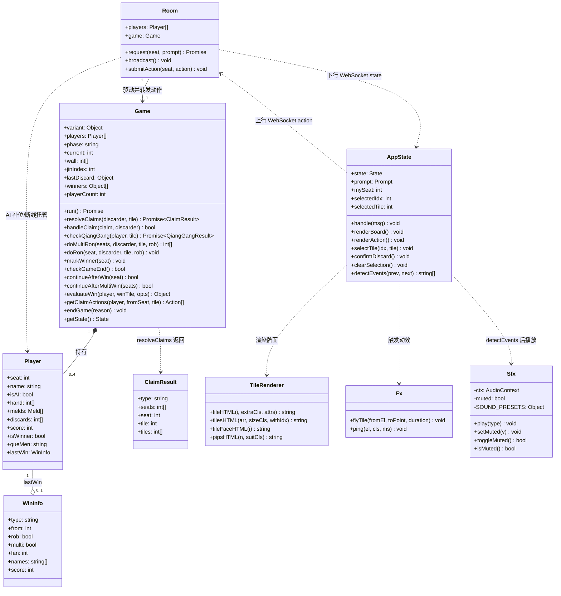
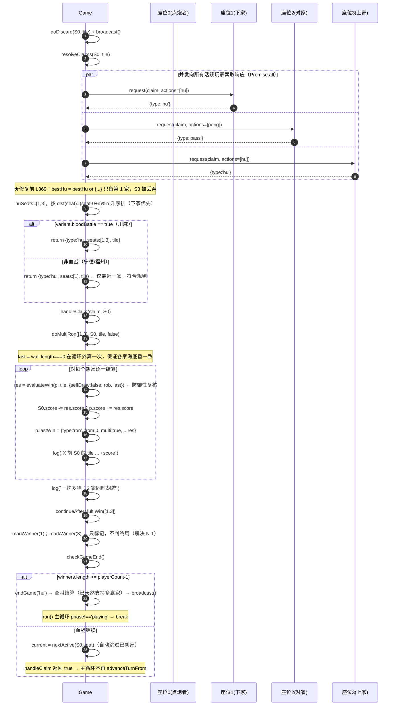
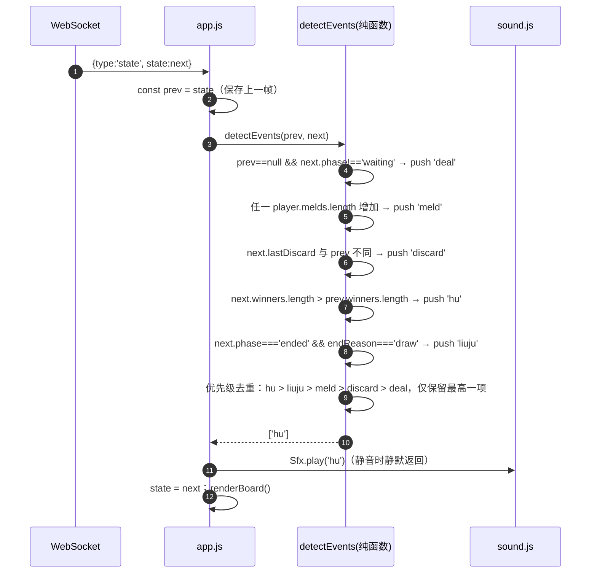
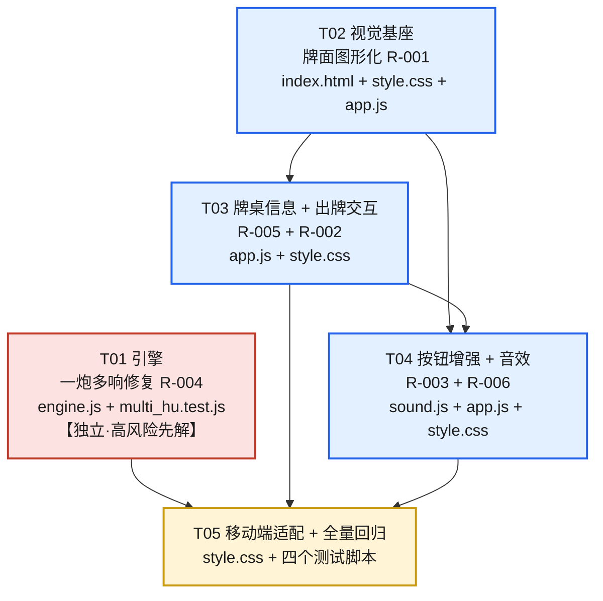

# 在线麻将 — 实现方案与任务拆解（本轮迭代）

> **版本**: v1.0 | **日期**: 2026-08-20 | **作者**: 高见远（架构师）
> **项目路径**: `C:/Users/Y/WorkBuddy/2026-08-20-15-33-48/mahjong-game`
> **上游输入**: `docs/prd-improvement.md`（许清楚 / 产品经理）
> **本轮范围**: P0 六项（R-001 ~ R-006），其中 R-004 为规则正确性必修 Bug。**不做** P1/P2。
> **定位**: 既有项目的**增量改造**方案 —— 复用现有引擎与渲染结构，不推倒重写。

---

## 0. 本轮已拍板的前置决策（来自用户，PRD 的 Open Questions 已关闭）

| # | 决策 | 对设计的约束 |
|---|------|--------------|
| D-1 | **视觉风格 = 国风写实** | 保留 `--felt / --felt-dark / --gold / --tile-bg` 等既有变量；牌面走真实麻将质感与配色，沉稳精致，不走卡通 |
| D-2 | **目标设备 = 桌面优先、兼顾移动** | PC 浏览器为主要打磨对象；手机（含 iPhone SE 375×667）要求「能玩、不溢出」，不做移动端布局重构（那是 P1 的 R-007） |
| D-3 | 福州/宁德规则差异、单人离线模式、音效具体风格 **本轮不做** | 但必须留扩展点：`variants.js` 配置化差异、音效模块可插拔可调参 |

---

# Part A：系统设计

## 1. 实现方案与框架选型

### 1.1 技术栈结论：零新增依赖

| 维度 | 结论 | 说明 |
|------|------|------|
| 后端 | **沿用 Node.js + `ws`** | `package.json` 现有唯一依赖 `ws@^8.21.3`，本轮不新增 |
| 前端 | **沿用纯 HTML/CSS/JS，零构建** | 不引入 Vite/React/打包器。`server.js` 直接静态托管 `public/`，保持「改文件即生效」的开发体验 |
| 牌面图形 | **CSS 绘制（汉字 + CSS pip）** | 见 §1.3 决策论证。**不用** Unicode 麻将字符，**不引入**图片/SVG 素材文件 |
| 动画 | **CSS `@keyframes` / `transition` + 极薄 JS 触发层** | 无动画库 |
| 音效 | **Web Audio API 程序化合成** | 零音频文件、零依赖、零网络请求，完全满足「无构建」约束 |
| 测试 | **沿用 `node:assert` + 现有三个测试脚本** | 新增一个同风格的纯 Node 测试文件，不引入 Jest/Mocha |

> **依赖包列表结论：本轮新增依赖 = 空。** `package.json` 的 `dependencies` 保持 `{"ws": "^8.21.3"}` 不变。
> 唯一建议的 `package.json` 改动是 `scripts.test` 串联新测试文件（见 T01 验收点）。

### 1.2 核心技术难点与应对

| # | 难点 | 应对方案 |
|---|------|----------|
| N-1 | **一炮多响修复涉及主循环控制流**：`continueAfterWin()` 内部会调用 `endGame()`。若在多胡家循环里逐个调用，`endGame()` 就可能在「部分胡家尚未标记 `isWinner`」时触发，导致这些胡家不进入 `winners`、拿不到查叫赔付、前端结算也不显示为赢家 | 把「标记赢家」与「判定终局」**拆成两个函数**（`markWinner()` / `checkGameEnd()`），批量标记后再判一次终局，把隐式契约变成显式保证。原 `continueAfterWin()` 保留为薄包装，**所有既有调用点零改动** → 零回归风险。详见 §5.1 改造点 ③ |
| N-2 | **牌面图形化不能依赖外部素材**，又要「国风写实 + 花色配色区分」 | 万/字用汉字（真实麻将万子本就是汉字）、筒/条用 CSS 绘制的点阵/竹条。全部可被 CSS `color` 着色 → 满足 PRD 硬性验收点「万=红/筒=蓝/条=绿/字=黑」 |
| N-3 | **出牌飞出动画会被服务端 state 广播的重渲染打断**（`renderBoard()` 每帧 `board.innerHTML = ''`） | 动画走**脱离渲染树的替身元素**：把牌克隆到独立的 `#fxLayer`（`position:fixed`）上做飞行，原牌所在 DOM 被重建也不影响动画。同时**不延迟** WS 提交，避免占用回合倒计时 |
| N-4 | **触摸 hit area ≥44×44px 但牌的视觉尺寸只有 40×56（移动端 34×48）** | 用 `::after` 伪元素向外扩张不可见热区（`inset:-4px -3px`），视觉尺寸不变而热区达标。伪元素不是事件目标，事件委托的 `closest('.tile')` 仍正确命中 |
| N-5 | **前端只收到 state 全量快照，没有事件流**，音效却需要「发生了什么」 | 引入纯函数 `detectEvents(prevState, nextState)` 做**状态差分**推导事件，并做优先级去重（胡 > 碰杠 > 出牌），避免一帧内多音重叠 |
| N-6 | **浏览器自动播放策略**：未经用户手势创建/恢复的 `AudioContext` 会被挂起 | `sound.js` 懒创建 `AudioContext`，并在 `document` 上挂一次性 `pointerdown/keydown` 监听执行 `ctx.resume()` |
| N-7 | **牌尺寸从 26×36 放大到 40×56 会撑爆现有布局**：`.seat` 固定 `width:168px`，13~14 张手牌在 168px 内会折成 4 行 | 采用**最小侵入方案**：仅让 `.seat.bottom` 变为全宽（`left:0;right:0;transform:none`），手牌单行 `flex-wrap:nowrap` + `overflow-x:auto`。桌面 14×40+13×4≈612px < board 760px 可完整单行显示；移动端自动横向滚动。**不重构 `renderBoard()` 的 DOM 结构** |
| N-8 | **弃牌区被碰/杠走的牌仍留在 `discards` 数组**（`doMeldClaim()` 未移除），会让「最后一张牌高亮」标错 | 前端用**防御性判定**规避：仅当 `discards[last] === state.lastDiscard.tile` 时才高亮。引擎侧的数据清理列入待明确事项，本轮不改引擎数据语义 |

### 1.3 关键选型决策：牌面为什么用 CSS 绘制而不是 Unicode 麻将字符

PRD 与需求方均提到「可用 Unicode 麻将字符 🀇🀈…」。经评估**否决**该方案，理由：

1. **跨平台字形不可控**：Windows 由 `Segoe UI Symbol` 渲染为单色细线字形，部分 Android 缺字形显示豆腐块，iOS/部分 Chrome 可能按 **彩色 emoji** 呈现。三端观感完全不同，与 D-1「国风写实、沉稳精致」的一致性要求冲突。
2. **彩色 emoji 呈现时 CSS `color` 失效**，无法实现 PRD 硬性验收点「万=红 / 筒=蓝 / 条=绿 / 字=黑」的花色配色区分。
3. **版面不可控**：字形尺寸受字体基线/内边距影响，难以在 40×56px 的牌体内精确居中和缩放。
4. CSS 绘制**零依赖、零素材文件、可精确控制、可用 CSS 变量整体缩放**，完全契合「无构建」约束。

**采纳方案**：
- **万子 (m)**：上「一~九」汉字 + 下「萬」字，`--man` 红。真实麻将万子就是汉字，天然国风。
- **筒子 (p)**：CSS 绘制圆点阵（`radial-gradient` 立体感圆点），1~9 个，`--pin` 蓝。
- **条子 (s)**：CSS 绘制竖竹条阵，1~9 个，`--sou` 绿。
- **字牌 (z)**：大号繁体汉字「東南西北中發白」。以黑为主，其中 **中=红、發=绿、白=蓝色双线空框**（真实麻将写实惯例）。
  - > 这是对 PRD「字=黑」的**写实化细化**，若需严格统一为黑，改 `.tile.z` 的三条覆盖规则即可。
- **降级预案（防止任务卡死）**：若 pip 点阵绘制成本超预期，允许筒/条降级为「汉字数字 + 花色字（筒/条）」，仍为国风且清晰可辨，`tileHTML()` 对外契约不变。

---

## 2. 文件列表

> 标注：**[改]** = 修改既有文件；**[新]** = 新增文件；**[不动]** = 本轮完全不碰

```
mahjong-game/
├── package.json                    [改] 仅 scripts.test 串联新测试（无依赖变更）
├── docs/
│   ├── prd-improvement.md              [不动] 上游 PRD
│   ├── architecture.md                 [新] 本文档
│   ├── class-diagram.mermaid           [新] 类图
│   ├── sequence-diagram.mermaid         [新] 时序图①出牌全链路
│   ├── sequence-diagram-multihu.mermaid [新] 时序图②一炮多响结算（R-004）
│   └── sequence-diagram-sfx.mermaid     [新] 时序图③音效事件推导（R-006）
├── src/
│   ├── engine.js                   [改] ★R-004 一炮多响修复（唯一需改的服务端文件）
│   ├── tiles.js                    [不动]
│   ├── variants.js                 [不动] 差异化留待 R-013（P1）
│   ├── scoring.js                  [不动]
│   ├── ai.js                       [不动] 强度提升留待 R-008（P1）
│   ├── room.js                     [不动]
│   └── server.js                   [不动] 无需新增 MIME（sound.js 走既有 '.js'）
├── public/
│   ├── index.html                  [改] 新增 #fxLayer、#muteBtn、sound.js 引入
│   ├── css/style.css               [改] ★主战场：牌面/尺寸变量/选中态/按钮/座位高亮/动效/媒体查询
│   └── js/
│       ├── app.js                  [改] ★主战场：tileHTML / renderBoard / 两步出牌 / mkBtn / 事件差分
│       └── sound.js                [新] Web Audio 程序化音效模块（可插拔）
└── test/
    ├── engine.test.js              [改] 保持回归 + 可选补一条多响用例
    ├── multi_hu.test.js            [新] ★R-004 专项回归测试
    ├── ws_smoke.js                 [不动] 端到端回归基线
    └── repro_nan.js                [不动] 防 NaN 回归基线
```

**服务端改动面 = 1 个文件（`src/engine.js`）**，前端改动面 = 3 改 1 新。改造边界清晰、可控。

---

## 3. 数据结构与接口

### 3.1 服务端：`src/engine.js` 接口变更

```js
// ── 改造：收集全部胡家，并按座次距离排序 ─────────────────────────
/**
 * @param {Player} discarder 出牌者
 * @param {number} tile      被打出的牌索引
 * @returns {null
 *   | { type:'hu',   seats:number[], tile:number }   // ★变更：seat → seats 数组
 *   | { type:'peng'|'gang', seat:number, tile:number }
 *   | { type:'chi',  seat:number, tile:number, tiles:number[] }}
 */
async resolveClaims(discarder, tile)

// ── 新增：批量点炮结算（一炮多响的核心） ──────────────────────────
/**
 * 对 seats 中每一家分别复核并结算点炮胡；点炮者对每家全额赔付。
 * @param {number[]} seats     胡家座位（已按下家优先排序）
 * @param {Player}   discarder 点炮者
 * @param {number}   tile      胡的那张牌
 * @param {boolean}  rob       是否抢杠胡
 * @returns {number[]} 实际结算成功的座位（复核失败的会被剔除）
 */
doMultiRon(seats, discarder, tile, rob)

// ── 新增：把「标记赢家」与「判定终局」解耦（解决 N-1） ──────────────
markWinner(seat)              // 仅置 isWinner + push winners，不判终局；幂等
checkGameEnd()                // 返回 true=继续血战 / false=已 endGame
continueAfterMultiWin(seats)  // 批量标记后统一判一次终局

// ── 保持兼容（既有调用点零改动） ──────────────────────────────────
continueAfterWin(seat)        // = markWinner(seat) + checkGameEnd()
doRon(seat, discarder, tile, rob)  // = doMultiRon([seat], ...) 的薄包装

// ── 改造：抢杠也支持多响（同一模式，消除同类潜在 Bug） ──────────────
/** @returns {null | { seats:number[] }}   ★变更：{seat} → {seats} */
async checkQiangGang(player, tile)

// ── 改造：支持 claim.seats ─────────────────────────────────────────
handleClaim(claim, discarder)  // 返回 true=已处理(勿轮转) / false=无响应(需轮转)
```

**`player.lastWin` 结构新增字段**（前端可选用于结算界面展示）：
```js
{ type:'ron', from:number, rob:boolean, multi:boolean /* ★新增：是否一炮多响 */,
  fan:number, names:string[], score:number, win:true, special:string, tile:number }
```

**`getState()` 无需任何改动** —— R-005 所需的 `current` / `players[].score` / `wallCount` / `lastDiscard` / `winners` 全部已存在。这是本轮 R-005 能做到「零服务端改动」的原因。

### 3.2 前端：`public/js/sound.js`（新增模块）

```js
/** 音效类型（恰好 5 种，对齐 R-006 验收） */
type SfxType = 'deal' | 'discard' | 'meld' | 'hu' | 'liuju';

window.Sfx = {
  play(type: SfxType): void,     // 未初始化/静音时静默返回，绝不抛异常
  setMuted(v: boolean): void,    // 落 localStorage['mj_muted']
  toggleMuted(): boolean,        // 返回切换后的 muted 状态
  isMuted(): boolean,
  _ensureCtx(): void,            // 懒创建 AudioContext + resume（内部）
};

/** 音色参数集中在文件顶部，便于用户试听后微调（可插拔扩展点） */
const SOUND_PRESETS = {
  deal:    { /* 2~3 段轻 click，间隔 40ms，总时长 ~180ms */ },
  discard: { /* 木质"啪"：噪声脉冲经 bandpass ~1.2kHz，decay 80ms */ },
  meld:    { /* 低频 thunk，音高更低，decay ~150ms */ },
  hu:      { /* 五声音阶三音上行琶音，总时长 ~600ms */ },
  liuju:   { /* 下行两音 + 轻微失谐，~500ms */ },
};
// 约束：所有音效时长 < 1s（PRD 硬性要求）；master gain 默认 0.25
```

### 3.3 前端：`public/js/app.js` 接口变更

```js
// ── 牌面渲染（唯一牌面出口） ───────────────────────────────────────
/** @param i 牌索引 0..33  @param extraCls 附加 class  @param attrs 附加属性串 */
function tileHTML(i, extraCls, attrs): string
/** @param sizeCls ''|'small'|'mini'  @param withIdx 是否写入 data-idx */
function tilesHTML(arr, sizeCls, withIdx): string
function tileFaceHTML(i): string        // 内部：汉字 or pip 点阵
function pipsHTML(n, suitCls): string   // 内部：生成 n 个 <i class="pip">

// ── 出牌两步确认状态 ───────────────────────────────────────────────
let selectedIdx = null;   // 选中的手牌在 hand 数组中的下标（区分同值重复牌）
let selectedTile = null;  // 选中的牌索引值（提交用）
function selectTile(idx, tile): void    // 第一步：选中/换选
function confirmDiscard(): void         // 第二步：飞出 + 提交
function clearSelection(): void         // 清空选中态（提交后/换 prompt/点空白）

// ── 动效触发层（JS 只负责加删 class 与克隆替身） ──────────────────
const Fx = {
  /** 把 fromEl 克隆到 #fxLayer 飞向 toPoint，动画期间不受重渲染影响 */
  flyTile(fromEl: HTMLElement, toPoint: {x:number,y:number}, duration = 300): void,
  /** 给元素临时加 class 播一次性动效，ms 后自动移除 */
  ping(el: HTMLElement, cls: string, ms: number): void,
};

// ── 音效事件推导（纯函数，可单测） ────────────────────────────────
/** 对比前后两帧 state，推导出应播放的音效类型（已做优先级去重） */
function detectEvents(prev: State|null, next: State): SfxType[]

// ── 动作按钮 ───────────────────────────────────────────────────────
/** @param icon 图标字符（来自 ACT_ICON 映射，便于后续换 SVG） */
function mkBtn(cls, label, fn, icon): HTMLButtonElement
const ACT_ICON = { hu:'🎉', peng:'👐', gang:'💥', chi:'⬆️', pass:'⏭️', que:'🚫', discard:'✅' };
```

### 3.4 CSS 契约（`public/css/style.css`）

```css
/* 牌尺寸「唯一真源」——禁止在别处硬编码 width/height */
:root { --tile-w:40px; --tile-h:56px; --tile-r:6px; }
@media (max-width:560px){ :root{ --tile-w:34px; --tile-h:48px; } }

/* 小尺寸通过「重定义变量」实现，牌面内部字号/点阵按变量 calc 自动等比缩放 */
.tile.small { --tile-w:26px; --tile-h:36px; }   /* 副露 */
.tile.mini  { --tile-w:22px; --tile-h:30px; }   /* 弃牌区 */

/* 新增颜色变量（PRD §5.2） */
:root { --felt-light:#0d8a4a; --danger:#e74c3c; --success:#27ae60;
        --muted:rgba(255,255,255,.55); }
```

**状态 class 清单（JS 加删，CSS 定义外观）**：

| class | 载体 | 含义 | 需求 |
|-------|------|------|------|
| `.tile.jin` + `<b class="jin-mark">金</b>` | 牌 | 金牌：金框 + 光晕 + 「金」角标 | R-001 |
| `.tile.back` | 牌 | 牌背统一纹样 | R-001 |
| `.tile.discardable` | 牌 | 本回合可出（含 `::after` 扩张热区） | R-002 |
| `.tile.sel` | 牌 | **已选中**：上浮 + 金边 + 微放大（启用既有空样式） | R-002 |
| `.tile.last-discard` | 牌 | 弃牌区最后一张：醒目描边 + 轻脉冲 | R-005 |
| `.seat.active` | 座位 | 当前回合：边框发光 + 300ms 过渡 | R-005 |
| `.seat.winner` | 座位 | 已胡家 | R-005 |
| `.btn-act.hu` | 按钮 | 胡按钮脉冲动画 `@keyframes huPulse` | R-003 |
| `.fx-tile` | 替身 | `#fxLayer` 内的飞行替身 | R-002 |

**`@keyframes` 清单**：`huPulse`（胡按钮呼吸 1.4s loop）、`lastDiscardPulse`（最后弃牌 1.2s loop）、`seatGlow`（座位高亮呼吸）、`tileFlyOut`（备用）。

**无障碍/低端设备安全阀**（必须实现）：
```css
@media (prefers-reduced-motion: reduce) {
  *, *::before, *::after { animation: none !important; transition: none !important; }
}
```

### 3.5 类图



---

## 4. 程序调用流程

### 4.1 出牌全链路（两步确认 → 飞出动效 → WS 提交 → 引擎响应 → 状态下发 → 渲染）

```mermaid
sequenceDiagram
    autonumber
    participant U as 玩家
    participant DOM as 手牌 DOM
    participant App as app.js
    participant FxL as Fx / #fxLayer
    participant Sfx as sound.js
    participant WS as WebSocket
    participant R as Room
    participant G as Game(engine)

    Note over App: prompt.type='turn'，已给手牌加 .discardable
    U->>DOM: 第 1 次点击某张手牌
    DOM->>App: click 事件冒泡（事件委托 closest('.tile.discardable')）
    App->>App: selectTile(idx, tile)：selectedIdx=idx
    App->>DOM: 移除旧 .sel，为该牌加 .sel（上浮+金边+微放大）
    App->>App: renderAction() 追加「✅ 出牌」确认按钮

    U->>DOM: 第 2 次点击同一张牌（或点确认按钮）
    DOM->>App: click → 判定 idx === selectedIdx → confirmDiscard()
    App->>FxL: Fx.flyTile(牌元素, board中心, 300ms)
    FxL->>FxL: 克隆牌到 #fxLayer(position:fixed) → rAF 设置 transform+opacity
    App->>Sfx: Sfx.play('discard')
    App->>WS: send({action:'action', move:{type:'discard', tile}})
    App->>App: clearSelection() + 动作条置「已提交，等待其他玩家…」

    Note over App,FxL: 提交不等待动画，替身在独立图层继续飞行（不被重渲染打断）

    WS->>R: submitAction(seat, move)
    R->>R: clearTimeout(倒计时) → pending[seat].resolve(move)
    R->>G: await request() 兑现
    G->>G: doDiscard(p, tile)：手牌移除/入弃牌堆/更新 lastDiscard
    G->>R: broadcast()
    R->>WS: {type:'state', state}（按座位裁剪他人手牌）
    WS->>App: onmessage
    App->>App: prevState=state; state=新state
    App->>App: detectEvents(prev,next) → ['discard'] 已本地播过则跳过
    App->>App: renderBoard()：重建座位/牌面，弃牌区末张加 .last-discard
    FxL->>FxL: duration 后移除替身元素

    G->>G: await resolveClaims(p, tile) —— 见 4.2
```

### 4.2 一炮多响结算时序（R-004 核心）



### 4.3 音效事件推导流程



---

## 5. 关键改造点详解（工程师照做用）

### 5.1 R-004 一炮多响：`src/engine.js` 逐点改造

#### 改造点 ①：`resolveClaims()`（当前 L357-377）—— 收集全部胡家 + 座次排序

```js
// 【替换 L365-376 的 bestHu/bestGang/bestChi 逻辑】
const n = this.playerCount;
const dist = (seat) => (seat - discarder.seat + n) % n;   // 下家=1 最小，上家最大

const huSeats = [];
let bestGang = null, bestChi = null;
for (const r of results) {
  if (!r || !r.a || r.a.type === 'pass') continue;
  const a = r.a;
  if (a.type === 'hu') {
    huSeats.push(r.seat);                                  // ★不再只留第一家
  } else if (a.type === 'peng' || a.type === 'gang') {
    if (!bestGang || dist(r.seat) < dist(bestGang.seat))   // ★由「数组顺序」改为「座次最近」
      bestGang = { type: a.type, seat: r.seat, tile };
  } else if (a.type === 'chi') {
    if (!bestChi || dist(r.seat) < dist(bestChi.seat))
      bestChi = { type: 'chi', seat: r.seat, tile, tiles: a.tiles };
  }
}
if (huSeats.length) {
  huSeats.sort((x, y) => dist(x) - dist(y));               // 下家优先
  const seats = this.variant.bloodBattle ? huSeats : [huSeats[0]];
  return { type: 'hu', seats, tile };                      // ★契约变更：seat → seats
}
if (bestGang) return bestGang;
if (bestChi) return bestChi;
return null;
```

> **顺带修正的既有缺陷**：原 `bestHu/bestGang/bestChi` 取的是 `this.players` 的**座位索引顺序**（0,1,2,3），而非「离出牌者最近」的规则顺序。改为 `dist()` 排序后，即使非血战模式也更符合规则（PRD 验收「非血战仍只取第一家」中的「第一家」= 座次最近一家）。此改动**不影响现有测试**（测试仅断言正常结束与分数有限）。

#### 改造点 ②：新增 `doMultiRon()`（放在 `doRon()` 旁，约 L265 后）

```js
doMultiRon(seats, discarder, tile, rob) {
  const last = this.wall.length === 0;      // ★循环外算一次，保证各家「海底」番一致
  const settled = [];
  for (const seat of seats) {
    const p = this.bySeat(seat);
    const res = this.evaluateWin(p, tile, { selfDraw: false, rob: !!rob, last });
    if (!res) { this.log(`[warn] ${p.name} 胡牌复核失败，跳过结算`); continue; }  // 防御
    discarder.score -= res.score;           // ★点炮者对每家全额赔付
    p.score += res.score;
    p.lastWin = { type: 'ron', from: discarder.seat, rob: !!rob, multi: seats.length > 1, ...res };
    this.log(`${p.name} 胡 ${discarder.name} 的 ${tileName(tile)} ${res.names.join(' ')} +${res.score}`);
    settled.push(seat);
  }
  if (settled.length > 1) this.log(`一炮多响：${settled.length} 家同时胡牌`);
  return settled;
}

// 兼容包装：既有 doRon 调用点（含测试）无需修改
doRon(seat, discarder, tile, rob) { this.doMultiRon([seat], discarder, tile, rob); }
```

#### 改造点 ③：拆分 `continueAfterWin()`（当前 L397-404）—— 解决终局判定竞争

```js
markWinner(seat) {
  const p = this.bySeat(seat);
  if (p.isWinner) return;                   // 幂等
  p.isWinner = true;
  this.winners.push({ seat, name: p.name, info: p.lastWin });
}

checkGameEnd() {
  if (!this.variant.bloodBattle) { this.endGame('hu'); return false; }
  if (this.winners.length >= this.playerCount - 1) { this.endGame('hu'); return false; }
  return true;
}

continueAfterWin(seat)        { this.markWinner(seat); return this.checkGameEnd(); }   // ★行为完全不变
continueAfterMultiWin(seats)  { for (const s of seats) this.markWinner(s); return this.checkGameEnd(); }
```

> **为什么必须这样拆**（已实测验证）：旧 `continueAfterWin()` 是「标记 + 判终局 + 可能 `endGame()`」三件事的耦合体。若在多胡家循环里逐个调用，`endGame()` 可能在**部分胡家尚未 `markWinner`** 时就触发，后果是这些胡家：① 不进入 `this.winners` → 前端结算不显示为赢家；② 被 `endGame()` 的查叫循环跳过 → 收不到其他输家的查叫赔付。
> 在**当前**终局条件（`winners.length >= playerCount - 1`）下恰好不会踩中（实测 4 人局逐个调用两次均返回 `true`），但这是**脆弱的隐式契约**：一旦终局条件调整，或将来非血战模式也要支持多响（`!bloodBattle` 分支会在第 1 家就 `endGame()` 并丢弃其余），立刻退化为漏结算。拆分后「先全部标记、再判一次终局」是显式且不依赖终局条件的正确顺序。
> **零回归保证**：`continueAfterWin()` 语义与旧实现逐行等价，`doSelfHu`（自摸）、`checkQiangGang`（抢杠）两处既有调用点无需改动。

#### 改造点 ④：`handleClaim()`（当前 L379-391）

```js
handleClaim(claim, discarder) {
  if (!claim) return false;
  if (claim.type === 'hu') {
    const seats = claim.seats || (claim.seat != null ? [claim.seat] : []);   // 向后兼容
    const settled = this.doMultiRon(seats, discarder, claim.tile, false);
    if (settled.length === 0) return false;        // 全部复核失败 → 视作无响应，正常轮转
    if (this.continueAfterMultiWin(settled)) this.current = this.nextActive(discarder.seat);
    return true;                                    // 已处理，调用方不要再 advanceTurnFrom
  }
  this.doMeldClaim(claim.seat, discarder, claim);
  this.mustDiscardSeat = claim.seat;
  return true;
}
```

#### 改造点 ⑤：`run()` 主循环去重（当前 L332-339）

原代码在**主出牌路径**里重复实现了一遍 hu 处理，而 `mustDiscardSeat` 路径走的是 `handleClaim()` —— 两条路径逻辑不一致，是本 Bug 的温床。**删除 L333-338 的特例分支**，统一为：

```js
const discTile = (act.type === 'discard') ? act.tile : p.hand[0];
this.doDiscard(p, discTile); this.broadcast();
const claim = await this.resolveClaims(p, discTile);
if (!this.handleClaim(claim, p)) this.advanceTurnFrom(seat);
if (this.phase !== 'playing') break;
```

> 此时两条出牌路径（正常回合 / 杠后补出牌）的 claim 处理**完全同构**，后续维护不会再出现单边遗漏。

#### 改造点 ⑥：`checkQiangGang()`（当前 L345-355）—— 抢杠多响（同类 Bug 一并消除）

```js
async checkQiangGang(player, tile) {
  const reactors = this.players.filter(p => p.seat !== player.seat && this.isActive(p));
  const results = await Promise.all(reactors.map(p => { /* 原逻辑不变 */ }));
  const n = this.playerCount;
  const dist = (s) => (s - player.seat + n) % n;
  const huSeats = results.filter(s => s != null).sort((a, b) => dist(a) - dist(b));
  if (!huSeats.length) return null;
  return { seats: this.variant.bloodBattle ? huSeats : [huSeats[0]] };   // ★{seat} → {seats}
}
```

配套 `run()` 抢杠分支（当前 L318-324）：
```js
const ron = await this.checkQiangGang(p, act.tile);
if (ron) {
  const settled = this.doMultiRon(ron.seats, p, act.tile, true);
  if (settled.length) {
    if (!this.continueAfterMultiWin(settled)) break;
    this.current = this.nextActive(p.seat);
    continue;
  }
}
```

#### 赔付规则声明（需用户确认的规则假设）

本设计采用 **「点炮者对每位胡家全额赔付」**（川麻血战到底的通行规则）。
若本地规则为「只赔最近一家」或「多家平摊」，**只需改 `doMultiRon()` 内的分数计算，其余结构不变**。

### 5.2 R-001/R-002/R-003/R-005 前端改造要点

| 需求 | 改造位置 | 要点 |
|------|----------|------|
| R-001 | `app.js:133 tileHTML` | 重写为 `tileHTML(i, extraCls, attrs)`；内部调 `tileFaceHTML(i)`：万/字出汉字、筒/条出 `pipsHTML()`;金牌追加 `<b class="jin-mark">金</b>` |
| R-001 | `style.css:69-84` | `.tile` 改用 `--tile-w/--tile-h`；新增 `.pips/.pip` 点阵布局（`.n1`~`.n9` 九套 grid）；`.tile.back` 换 `repeating-linear-gradient` 交叉纹；`.tile.jin` 金框+光晕+角标定位 |
| R-002 | `app.js:198-205` | 点击委托改两步：`idx !== selectedIdx` → `selectTile()`；相等 → `confirmDiscard()`。点击 board 空白 → `clearSelection()` |
| R-002 | `style.css:82-84` | **启用**已定义未用的 `.tile.sel`：`translateY(-10px) scale(1.05)` + 金边 + `z-index`；`.tile.discardable::after{inset:-4px -3px}` 扩热区；`touch-action:manipulation` |
| R-003 | `app.js:260 mkBtn` | 增加 `icon` 参数，产出 `<span class="ico">…</span><span class="lbl">…</span>`；图标来自 `ACT_ICON` 常量（换 SVG 的扩展点） |
| R-003 | `style.css:91-98` | `.btn-act{min-height:48px;min-width:64px}`；`:active{transform:scale(.95)}`；`.btn-act.hu{animation:huPulse 1.4s infinite}`；`:focus-visible` 描边 |
| R-005 | `app.js:143-192` | 座位加 `.active`（`pl.seat===state.current && phase==='playing'`）/`.winner`；名字旁 `<span class="score">`；中央信息改为结构化 `.center-info`（大号剩余牌数 + 金牌 chip + 轮到 chip + 血战已胡家数）；弃牌区末张按防御规则加 `.last-discard` |
| R-005 | `style.css:54-67` | `.seat.active` 发光 + 300ms 过渡；`.seat .score` 正负配色（`--gold`/`--danger`/`--muted`）；`.center-info` 排版；`.tile.last-discard` 描边 + `lastDiscardPulse` |

**最后弃牌高亮的防御性规则**（应对 N-8，必须照此实现）：
```
若 state.lastDiscard 存在
  且 pl.seat === state.lastDiscard.seat
  且 pl.discards[pl.discards.length-1] === state.lastDiscard.tile
则给该 seat 弃牌区最后一个 .tile 加 .last-discard
```
这样即使该牌事后被碰/杠（引擎当前不会从 `discards` 移除），也不会出现错误高亮。

### 5.3 布局尺寸放大的连带处理（N-7）

```css
.seat.bottom { left:0; right:0; bottom:6px; width:100%; transform:none; }  /* 由 168px 定宽改全宽 */
.myhand { flex-wrap:nowrap; overflow-x:auto; justify-content:center; gap:4px; }
.board  { min-height:460px; }        /* 移动端 380px */
body    { overflow-x:hidden; }       /* 溢出安全阀 */
```
桌面校验：14 张 × 40px + 13 × 4px gap ≈ 612px < board 760px → 单行完整显示。
移动端校验：14 × 34 + 13 × 3 ≈ 515px > 375px → `overflow-x:auto` 横向滚动，不溢出页面。

---

# Part B：任务拆解

## 6. 依赖包列表

**新增第三方依赖：无（空）。**

```
（保持不变）
- ws@^8.21.3 : WebSocket 服务端，既有依赖
（本轮全部新能力均由平台原生能力实现）
- Web Audio API   : 浏览器原生，R-006 程序化音效，零文件零依赖
- CSS Grid / 自定义属性 / @keyframes : 浏览器原生，R-001/R-002/R-003/R-005
- node:assert     : Node 内置，R-004 回归测试
```

`package.json` 唯一改动（无依赖变更）：
```json
"scripts": { "test": "node test/engine.test.js && node test/multi_hu.test.js" }
```

## 7. 任务列表（按实现顺序，含依赖与验收点）

> 排序原则：**风险最高且独立的引擎修复先做**（T01），再做视觉基座（T02），基座之上并行叠加交互与信息（T03/T04），最后统一收尾适配与全量回归（T05）。

---

### T01 · 引擎：一炮多响修复 + 专项回归测试
**需求**：R-004 ｜ **优先级**：P0（规则正确性前提）｜ **依赖**：无（可与 T02 并行开工）
**涉及文件**：`src/engine.js`[改]、`test/multi_hu.test.js`[新]、`test/engine.test.js`[改·可选补例]、`package.json`[改·test 脚本]

**实施步骤**（严格照 §5.1 的改造点 ①~⑥ 顺序执行）：
1. `resolveClaims()`：`huSeats` 数组收集 + `dist()` 座次排序 + 按 `variant.bloodBattle` 决定返回全部/仅最近一家；返回契约 `seat` → `seats`。
2. 新增 `doMultiRon(seats, discarder, tile, rob)`；把 `doRon()` 改为其薄包装。
3. 拆分 `continueAfterWin()` 为 `markWinner()` + `checkGameEnd()`，新增 `continueAfterMultiWin()`；保留 `continueAfterWin()` 语义不变。
4. `handleClaim()` 支持 `claim.seats`，走 `doMultiRon` + `continueAfterMultiWin`。
5. `run()` 删除 L333-338 的重复 hu 特例分支，统一由 `handleClaim()` 处理。
6. `checkQiangGang()` 返回 `{seats}`，配套改 `run()` 抢杠分支。
7. 新建 `test/multi_hu.test.js`（同现有测试风格，纯 `node:assert`，无框架）。

**测试用例规格**（下述牌型与期望值**已在真实引擎上实测验证**，工程师照抄即可）：

> 架构师实测结论（`node` 直连 `src/engine.js`）：
> - `deal()` 后川麻 `jinIndex === -1`、`wall.length === 56`（4 人局），`last` 为 `false`，无海底番干扰
> - 座位1 与 座位3 均可胡 `17`(9筒)，番种均为 `平胡+门清`，**各得 2 分**
> - 座位2 的 `getClaimActions()` 返回 `[]` → 必然 `pass`，不干扰断言
> - **当前代码 `resolveClaims()` 实际返回 `{"type":"hu","seat":1,"tile":17}` —— Bug 已复现，座位3 的胡被静默丢弃**
> - 两家结算后分数为 `座位0:-4  座位1:+2  座位3:+2`


```
公共准备：g = new Game(VARIANTS.sichuan, players(4), hooks); g.deal(); 之后覆盖手牌
  hooks.request: 若 actions 含 hu 则回 {type:'hu'}，否则 {type:'pass'}
  座位1 手牌 = [0,1,2,3,4,5,6,7,8, 9,10,11, 17]  queMen='s'   // 123m456m789m 123p 9p，听 9p(17)
  座位3 手牌 = [18,19,20,21,22,23,24,25,26, 9,10,11, 17] queMen='m' // 123s456s789s 123p 9p，听 9p
  座位2 手牌 = 任意不含 17、且对 17 无碰/胡的牌            // 保证其 pass
  座位0 为点炮者，打出 tile=17
  （9p 全局用量 = 1+1+1 = 3 ≤ 4，牌数合法；两家花色不重叠）

用例 1 · 血战多响收集：await g.resolveClaims(g.bySeat(0), 17)
  断言 result.type==='hu' && result.seats.length===2 && 深比较 result.seats === [1,3]
用例 2 · 血战多响结算：g.handleClaim(result, g.bySeat(0))
  断言 座位1.score === 2 且 座位3.score === 2 且两者 isWinner === true
  断言 座位0.score === -4                          ← 全额赔付两家（2+2），实测值
  断言 g.winners.length === 2
  断言 所有 score 均 Number.isFinite
用例 3 · 非血战只取最近一家：同样牌型换 VARIANTS.ningde（bloodBattle=false，注意 jinIndex 置 -1、去掉 queMen）
  断言 result.seats.length === 1
用例 4 · 座次排序：让座位2 出牌，座位0 与座位3 同时可胡
  断言 seats === [3, 0]                              ← dist(3)=1 < dist(0)=2，下家优先
用例 5 · 终局边界：3 人血战两家同时胡
  断言 g.phase==='ended'（winners.length 2 >= playerCount-1 2）且无漏结算
```

**验收点**：
- [ ] 川麻血战下多家同时胡同一张牌时，**全部**胡家被结算（`winners.length === 胡家数`），点炮者按家数累计赔付
- [ ] 宁德/福州（`bloodBattle=false`）仍只结算 1 家，且为**座次最近**的一家
- [ ] 一炮多响后 `current` 正确落到 `nextActive(discarder.seat)`，自动跳过已胡家；牌局不卡死
- [ ] 抢杠场景同样支持多响（`checkQiangGang` 返回 `seats`）
- [ ] **回归零破坏**：`node test/engine.test.js` 全绿、`node test/repro_nan.js` 全绿、`node test/ws_smoke.js` 4 个用例全绿
- [ ] `node test/multi_hu.test.js` 全绿；`npm test` 已串联该文件
- [ ] 日志出现「一炮多响：N 家同时胡牌」

---

### T02 · 前端视觉基座：牌面图形化 + 尺寸变量体系 + 结构挂载点
**需求**：R-001 ｜ **优先级**：P0 ｜ **依赖**：无（可与 T01 并行）
**涉及文件**：`public/index.html`[改]、`public/css/style.css`[改]、`public/js/app.js`[改]

> 本任务是后续所有前端任务的地基，**独占 `index.html` 的全部改动**（避免多任务改同一文件产生冲突）。

**实施步骤**：
1. `index.html`：
   - 牌桌容器内新增动效图层 `<div id="fxLayer"></div>`；
   - topbar 新增静音按钮 `<button id="muteBtn" class="ghost small">🔊</button>`（T04 才接线，此处只占位）；
   - `app.js` **之前**引入 `<script src="/js/sound.js"></script>`（T04 才创建文件，此处先写引用；文件缺失仅 404 不影响页面 —— 若介意可与 T04 同批提交）。
2. `style.css`：
   - `:root` 新增 `--tile-w/--tile-h/--tile-r` 与 PRD §5.2 的 `--felt-light/--danger/--success/--muted`；
   - `.tile` 改为消费变量；`.tile.small`/`.tile.mini` 通过**重定义变量**实现等比缩放；牌面字号用 `calc(var(--tile-h) * 系数)`；
   - 新增 `.pips` / `.pip` 与 `.n1`~`.n9` 点阵布局（筒=立体圆点、条=竖竹条）；
   - `.tile` 立体化：米白渐变 + 内高光 + 底部厚边 + 圆角，营造国风写实质感；
   - `.tile.z` 汉字大号；`中`红 / `發`绿 / `白`蓝色双线空框；
   - `.tile.back` 换 `repeating-linear-gradient` 交叉纹样；
   - `.tile.jin` 金框 + `box-shadow` 光晕 + `.jin-mark` 角标定位；
   - `#fxLayer{position:fixed;inset:0;pointer-events:none;z-index:40}`；
   - 加入 `prefers-reduced-motion` 安全阀。
3. `app.js`：
   - 重写 `tileHTML(i, extraCls, attrs)`，新增 `tileFaceHTML(i)`、`pipsHTML(n, suitCls)`；
   - `tilesHTML(arr, sizeCls, withIdx)`：副露传 `'small'`、弃牌传 `'mini'`、自己手牌传 `('', true)` 写入 `data-idx`；
   - 同步更新 `renderBoard()` 内 6 处调用与 `backTiles()`；
   - 按 §5.3 调整 `.seat.bottom` 全宽与 `.myhand` 单行滚动。

**验收点**：
- [ ] 万/筒/条/字四类牌均图形化：万=汉字数字+萬(红)、筒=圆点阵(蓝)、条=竹条阵(绿)、字=繁体汉字(黑/中红/發绿/白蓝框)
- [ ] 桌面牌面 40×56px、移动端 34×48px（改 `:root` 变量即全局生效，无硬编码尺寸残留）
- [ ] 一臂距离（约 60cm）可清晰辨认每张牌的数字与花色
- [ ] 金牌有金色边框 + 光晕 + 「金」角标，一眼可识别
- [ ] 牌背为统一纹样（非纯色渐变）
- [ ] 14 张手牌在桌面单行完整显示不折行；移动端可横向滑动且页面无横向溢出
- [ ] 副露区/弃牌区使用 small/mini 尺寸，四人局布局不重叠、不溢出
- [ ] 三种玩法（宁德/福州/川麻）牌桌均正常渲染，无 JS 报错

---

### T03 · 牌桌信息丰富化 + 出牌两步确认与飞出动效
**需求**：R-005 + R-002 ｜ **优先级**：P0 ｜ **依赖**：**T02**
**涉及文件**：`public/js/app.js`[改]、`public/css/style.css`[改]

**实施步骤**：
1. **R-005（纯前端，零服务端改动）**：
   - `renderBoard()` 中座位 div 追加 `.active`（当前回合）/`.winner`（已胡）class；
   - 名字行追加 `<span class="score">`，正分金/绿、负分红、零分弱化；
   - 中央信息由 L179-187 的内联样式 div 改为结构化 `.center-info`：**大号剩余牌数** + 「轮到 X」+ 金牌 chip +（血战时）「已胡 N 家」；
   - 弃牌区按 §5.2 防御性规则给最后一张加 `.last-discard`；
   - CSS：`.seat.active` 发光 + 300ms 过渡、`.seat .score` 配色、`.center-info` 排版、`.tile.last-discard` 描边 + `lastDiscardPulse`。
2. **R-002**：
   - 新增模块级 `selectedIdx / selectedTile` 与 `selectTile / confirmDiscard / clearSelection`；
   - 改写 `$('board')` 点击委托：首次点击选中（加 `.sel`），再次点同一 `data-idx` 确认出牌；点其他牌换选；点 board 空白清空选中；
   - `renderAction()` 在有选中时追加「✅ 出牌」确认按钮（双入口，便于触屏）；
   - `renderBoard()` 后按 `selectedIdx` 幂等重放 `.sel`（保证重渲染不丢选中态）；
   - `sendAction()` 与 prompt 变更时调用 `clearSelection()`；
   - 实现 `Fx.flyTile()`：克隆牌到 `#fxLayer` → `rAF` 设置 `transform` 飞向 board 中心 → 300ms 后移除；**先发 WS 再播动画**，不增加提交延迟；
   - CSS：启用 `.tile.sel`；`.tile.discardable::after` 扩热区；`.fx-tile` 过渡曲线。

**验收点**：
- [ ] 当前回合玩家座位有明显发光/边框，切换回合有 300ms 平滑过渡
- [ ] 每个座位名字旁显示实时分数，正负有配色区分
- [ ] 剩余牌数以大号字突出显示；金牌信息清晰；血战模式显示已胡家数
- [ ] 最后打出的牌在弃牌区有醒目标记；该牌被碰/杠后不出现错误高亮
- [ ] 点击手牌明显上浮 + 金边 + 微放大，与未选中牌视觉差异显著
- [ ] 再次点击同一张牌才真正出牌（两步防误触）；点其他牌可换选；点空白可取消
- [ ] 存在两张相同牌时，只有被点击的那一张进入选中态（`data-idx` 生效）
- [ ] 出牌后有约 300ms 飞向牌桌中央的动画，且**动画不被服务端状态刷新打断**
- [ ] 手牌触摸热区实测 ≥44×44px（DevTools 移动模拟测量）
- [ ] 出牌提交无额外延迟（不因动画而拖慢，回合倒计时不受影响）

---

### T04 · 动作按钮增强 + Web Audio 音效系统
**需求**：R-003 + R-006 ｜ **优先级**：P0 ｜ **依赖**：**T02**（结构挂载点）、**T03**（actionbar 与确认按钮共存）
**涉及文件**：`public/js/sound.js`[新]、`public/js/app.js`[改]、`public/css/style.css`[改]

**实施步骤**：
1. **R-003**：
   - `mkBtn(cls, label, fn, icon)` 增加图标参数，产出 `<span class="ico">`+`<span class="lbl">`；
   - 新增 `ACT_ICON` 常量集中管理图标（后续换 SVG 的唯一改动点）；
   - 更新 `renderAction()` 内全部 `mkBtn` 调用点（胡/碰/杠/吃/过/缺/出牌确认）；
   - CSS：`.btn-act` 尺寸 ≥48px 高、≥64px 宽；`:active{scale(.95)}`；`.btn-act.hu` 挂 `huPulse` 脉冲；`:focus-visible` 描边。
2. **R-006**：
   - 新建 `public/js/sound.js`，实现 §3.2 的 `window.Sfx` 契约；
   - 5 种音效全部用 `OscillatorNode` / `BufferSource(白噪声)` + `GainNode` 包络程序化合成，**不引用任何音频文件**；音色参数集中在顶部 `SOUND_PRESETS`；
   - 懒创建 `AudioContext`，在 `document` 上挂一次性 `pointerdown/keydown` 执行 `resume()`（应对自动播放策略）；
   - 静音状态持久化 `localStorage['mj_muted']`；`play()` 在未初始化/静音时静默返回且**绝不抛异常**；
   - `app.js`：实现纯函数 `detectEvents(prev, next)`（含优先级去重 hu > liuju > meld > discard > deal）；在 `handle()` 的 `case 'state'` 中先取 `prev` 再赋值 `state`，随后触发 `Sfx.play()`；
   - `app.js`：接线 `#muteBtn` 点击切换静音并同步 🔊/🔇 图标，初始化时读取持久化状态。

**验收点**：
- [ ] 胡/碰/杠/吃/过/缺 每个按钮都有对应图标 + 文字
- [ ] 按钮实测高度 ≥48px、触摸目标 ≥44px；按下有缩小反馈
- [ ] 可胡时「胡」按钮有持续脉冲动画，视觉上最抓眼
- [ ] 发牌 / 出牌 / 碰杠 / 胡牌 / 流局 五种事件均有对应音效
- [ ] 每个音效时长 < 1s，不拖慢节奏；同一帧多事件只播优先级最高的一个
- [ ] 顶栏静音开关生效，图标同步切换，刷新页面后静音状态保留
- [ ] 首次进入页面无自动播放报错（Console 无 AudioContext 警告阻断）
- [ ] `public/audio/` 目录**不存在**，无任何音频文件与外部请求
- [ ] 关闭音效（静音）时游戏功能完全正常 —— 音效模块可插拔

---

### T05 · 移动端适配收尾 + 全量回归验收
**需求**：R-001~R-006 的移动端表现 + 整体联调 ｜ **优先级**：P0 ｜ **依赖**：**T02、T03、T04**（T01 需已合入以便端到端回归）
**涉及文件**：`public/css/style.css`[改·媒体查询]、`public/js/app.js`[改·微调]、`test/*`[执行回归]

**实施步骤**：
1. 重写 `@media (max-width:560px)` 区块（替换现有 L112-117 的简单缩放）：
   - `:root` 覆盖 `--tile-w:34px; --tile-h:48px`；`.tile.small` 24×33、`.tile.mini` 20×28；
   - `.seat` 132px、`.seat .discards` 相应收窄并限制列数；
   - `.myhand` 横向滚动（`overflow-x:auto` + 隐藏滚动条 + `-webkit-overflow-scrolling:touch`）；
   - `.actionbar` 底部吸附（`position:sticky;bottom:0` + 半透明背景 + `backdrop-filter`），按钮换行排布、每个 ≥44px 高，追加 `padding-bottom:env(safe-area-inset-bottom)`；
   - `.board{min-height:380px}`；`.center-info` 精简为紧凑两行；
   - `body{overflow-x:hidden}` 兜底。
2. 交互细节：全局交互元素补 `touch-action:manipulation` 消除 300ms tap 延迟。
3. 全量回归：
   - `node test/engine.test.js` / `node test/multi_hu.test.js` / `node test/repro_nan.js`；
   - `npm start` 后 `node test/ws_smoke.js`（4 用例）；
   - 三种玩法 × (3人/4人) 手动过一局，观察 Console 零报错。
4. 视觉验收：桌面 1440×900 与移动 iPhone SE（375×667）逐项核对 PRD 验收标准。

**验收点**：
- [ ] iPhone SE（375×667）4 人局牌桌**无横向溢出**、座位不重叠、可正常完成一整局
- [ ] 移动端手牌可横向滑动查看全部 14 张，牌面 34×48px 清晰可辨
- [ ] 移动端动作按钮底部吸附、不被遮挡、每个 ≥44px 高；iPhone 安全区不裁切
- [ ] 桌面端（≥760px）体验为最佳：牌面 40×56、手牌单行、信息完整
- [ ] 三种玩法 × 3/4 人共 6 种组合均可正常开局并打到结算
- [ ] 四个测试脚本全部通过，无回归
- [ ] Console 无报错、无未捕获 Promise
- [ ] `package.json` 依赖仍仅 `ws`；`public/` 下无新增二进制/音频素材

---

## 8. 任务依赖图



**并行建议**：T01（服务端）与 T02（前端）**零文件重叠，可完全并行**。T03 与 T04 虽标注串行依赖，若由同一人顺序执行则天然满足；若并行，需约定 T04 不改 `renderAction()` 的选牌确认按钮分支（由 T03 拥有）。

---

## 9. 共享知识（跨文件约定，工程师必须遵守）

### 9.1 渲染与样式
1. **牌面渲染唯一出口是 `tileHTML()` / `tilesHTML()`** —— 严禁在 `renderBoard`、`renderAction`、`renderResult` 或任何其他位置手写牌的 DOM 字符串。
2. **牌尺寸唯一真源是 CSS 变量 `--tile-w` / `--tile-h`** —— 严禁在任何选择器里硬编码牌的 `width`/`height`；`.tile.small` / `.tile.mini` 一律通过**重定义变量**实现，牌面内部字号/点阵尺寸用 `calc(var(--tile-h) * 系数)` 表达，以获得自动等比缩放。
3. **所有颜色走 `:root` CSS 变量** —— 新增颜色必须先在 `:root` 声明；禁止新增硬编码色值（现存的 `#ff5a5a` 等应顺带替换为 `--danger`）。
4. **`renderBoard()` 必须幂等** —— 服务端 `state` 是全量快照且会高频重发，渲染函数被重复调用必须产生一致结果；一切前端瞬时态（如 `.sel`）必须能在重渲染后由 `selectedIdx` 重放。

### 9.2 动效与音效
5. **动效一律「CSS 定义外观 + JS 加删 class」** —— JS 只做两件事：加/删 class，或调用 `Fx.flyTile()`；严禁在 JS 里写 `el.style.transition = ...` 之类的内联动画。
6. **需要跨重渲染存活的动画必须走 `#fxLayer` 替身** —— 因为 `renderBoard()` 会 `innerHTML=''` 清空 board。
7. **音效唯一入口是 `window.Sfx.play(type)`** —— 严禁在 `app.js` 里直接 `new AudioContext()` 或引入音频文件。
8. **事件识别唯一入口是 `detectEvents(prev, next)` 纯函数** —— 严禁在渲染函数内部埋播音逻辑（否则重渲染会重复播放）。
9. 必须实现 `prefers-reduced-motion` 降级，作为低端设备与无障碍的安全阀。

### 9.3 前后端职责边界
10. **前端是纯展示层，不得自行推断规则** —— 能不能胡/碰/杠完全由服务端下发的 `prompt.actions` 决定；前端只负责把它渲染成按钮。这是既有的**服务端权威防作弊**架构，不得破坏。
11. **`state` 结构不新增字段** —— 本轮 R-005 所需数据（`current` / `players[].score` / `wallCount` / `lastDiscard` / `winners`）全部已存在，`getState()` 零改动。
12. WebSocket 消息协议不变：上行 `{action:'action', move:{...}}`，下行 `{type:'state'|'action'|'timeout'|'lobby'|'error'}`。

### 9.4 引擎侧
13. **点炮胡的结算唯一入口是 `doMultiRon(seats, ...)`** —— `doRon()` 仅作为单家的兼容包装保留，新代码不要直接调用。
14. **「标记赢家」与「判定终局」必须分离** —— 批量场景先全部 `markWinner()`，最后调一次 `checkGameEnd()`；严禁在多赢家循环里调用会触发 `endGame()` 的函数。
15. **座次优先级统一用 `dist(seat) = (seat - fromSeat + playerCount) % playerCount` 升序**（下家优先）—— 适用于胡、碰、杠、吃的竞争裁决。禁止依赖 `players` 数组的天然顺序。
16. **`variant` 是规则的唯一开关** —— 多响与否读 `variant.bloodBattle`，禁止在引擎里出现 `variant.key === 'sichuan'` 这类硬编码分支（现存 `endGame()` 中的一处属既有代码，本轮不动）。
17. 引擎为 CommonJS 且被三个测试脚本直接 `require`，**修改必须保持既有导出与既有方法签名的向后兼容**。

### 9.5 约束红线
18. **零新增 npm 依赖**；**零构建工具**；**零新增素材文件**（无图片、无音频、无字体）。
19. `src/tiles.js` / `variants.js` / `scoring.js` / `ai.js` / `room.js` / `server.js` **本轮不改**；若发现必须改，先回报架构师评估影响面。
20. 每个任务完成后至少跑一次 `node test/engine.test.js`，禁止把回归失败带入下一个任务。

---

## 10. 待明确事项（本轮不做，留给后续轮次）

| # | 事项 | 现状与建议 |
|---|------|-----------|
| U-1 | **一炮多响赔付规则**需用户最终确认 | 本设计采用「点炮者对每位胡家**全额**赔付」（川麻血战通行规则）。若本地规则为「只赔最近一家」或「多家平摊」，仅需改 `doMultiRon()` 内的分数计算，结构无需调整 |
| U-2 | **弃牌区数据小瑕疵**：被碰/杠取走的牌仍留在 `discards` 数组（`doMeldClaim()` 未移除） | 本轮以前端防御性判定规避（§5.2），不改引擎数据语义。建议下轮在 `doMeldClaim()` 中 `discarder.discards.pop()` 清理，需同步跑三个测试确认无回归 |
| U-3 | **字牌配色**：本设计按写实惯例做了 中=红 / 發=绿 / 白=蓝框，与 PRD「字=黑」略有出入 | 若需严格统一为黑，删除 `.tile.z` 的三条颜色覆盖规则即可，成本 <5 分钟 |
| U-4 | **音效音色**需用户试听后微调 | 程序化合成的音高/包络/音量参数已集中在 `sound.js` 顶部 `SOUND_PRESETS`，可独立迭代不影响其他代码 |
| U-5 | **福州 / 宁德真实规则差异**（PRD GP-06 / R-013） | 本轮两者配置仍完全相同。`variants.js` 已是配置化设计，差异化只需改配置、不动引擎 —— 扩展点已就绪，等用户提供实际规则 |
| U-6 | **AI 强度偏低**（PRD GP-02 / R-008） | 本轮不动 `ai.js`。注意：AI 目前 `decideClaim` 遇 hu 必胡，正好能触发一炮多响，可用于 T01 的实战验证 |
| U-7 | **断线重连**（PRD GP-03 / R-014） | 本轮不动 `room.js`，断线仍转 AI 托管 |
| U-8 | **单人离线模式**（PRD OQ-5） | 本轮不做。若后续要做，`src/engine.js` 为 CommonJS，需加一层 UMD/ESM 包装才能在浏览器直接复用引擎 —— 建议届时把导出方式统一，而非复制代码 |
| U-9 | **动画进阶项**（发牌依次入场、碰杠飞入、胡牌庆祝特效，PRD R-009） | 本轮只做 P0 的出牌飞出。`Fx.flyTile()` 已按通用「任意元素飞向任意点」设计，后续三项可直接复用该函数，无需重写 |
| U-10 | **日志区增强、手牌排序、听牌提示、结算界面增强、超时放宽** | 分别对应 PRD R-011 / R-016 / R-015 / R-020 / R-012，均为 P1/P2，本轮不做 |
| U-11 | **平板中间断点（560~759px）** | 本轮只做「桌面 + ≤560px 手机」两档（符合 D-2「兼顾移动、不溢出即可」）。平板会落到桌面样式，实测可用；若需精细化再补一档 |

---

*本文档基于对项目全部源码（7 个 `src/*.js`、`public/index.html`、`public/css/style.css`、`public/js/app.js`、3 个测试脚本、`package.json`）的实际逐行阅读产出，所有改造点均标注了具体文件与行号。*
